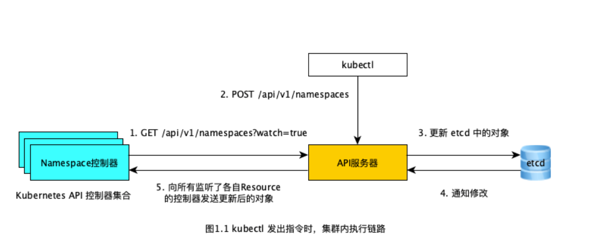

## k8s-API

Kubernetes API 使你可以在 Kubernetes 中查询和操纵 API 对象 （例如 Pod、Namespace、ConfigMap 和 Event）的状态。

大部分操作都可以通过kubectl命令行接口或类似 kubeadm这类命令行工具来执行，这些工具在背后也是调用 API。不过，你也可以使用 REST 调用来访问这些 API。 Kubernetes 为那些希望使用 Kubernetes API 编写应用的开发者提供一组客户端库。

### 类型

Kubernetes API 遵循 RESTful 原则，每个资源都是通过 URI 来表示的。

支持标准的 HTTP 方法，如 GET、POST、PUT、PATCH 和 DELETE。

比如 pod的api如下：

1. **创建 Pod：**
+ 使用 POST 请求在指定的 Namespace 中创建一个新的 Pod。
> POST /api/v1/namespaces/{namespace}/pods

2. **获取单个 Pod 详情：**
+ 使用 GET 请求获取特定 Namespace 中 Pod 的详细信息。
> GET /api/v1/namespaces/{namespace}/pods/{podname}

3. **获取 Pod 列表：**
+ 使用 GET 请求获取指定 Namespace 中所有 Pod 的列表。
> GET /api/v1/namespaces/{namespace}/pods
Bash

4. **删除 Pod：**
+ 使用 DELETE 请求删除特定 Namespace 中的 Pod。
> DELETE /api/v1/namespaces/{namespace}/pods/{podname}

5. **更新 Pod：**
+ 使用 PUT 或 PATCH 请求更新特定 Pod 的规格或状态。
> PUT /api/v1/namespaces/{namespace}/pods/{podname}/status

> PATCH /api/v1/namespaces/{namespace}/pods/{podname}

6. **观察 Pod：**
+ 使用 WATCH 机制通过 GET 请求监视 Pod 的变化。
> GET /api/v1/namespaces/{namespace}/pods/{podname}?watch=true

7. **获取 Pod 日志：**
+ 使用 GET 请求获取 Pod 的容器日志。
> GET /api/v1/namespaces/{namespace}/pods/{podname}/log

8. **执行命令在 Pod 中：**
+ 使用 POST 请求在 Pod 的容器中执行命令。
> POST /api/v1/namespaces/{namespace}/pods/{podname}/exec

9. **端口转发：**
+ 使用 POST 请求为 Pod 建立端口转发。
>POST /api/v1/namespaces/{namespace}/pods/{podname}/portforward

10. **编辑 Pod 状态：**
+ 使用 PUT 请求更新 Pod 的状态。
> PUT /api/v1/namespaces/{namespace}/pods/{podname}/status

11. **获取 Pod 的 Exec 路径：**
+ 使用 GET 请求获取 Pod 中容器的 Exec 路径。
>GET /api/v1/namespaces/{namespace}/pods/{podname}/exec

12. **获取 Pod 的 Attach 路径：**
+ 使用 GET 请求获取 Pod 中容器的 Attach 路径。
>GET /api/v1/namespaces/{namespace}/pods/{podname}/attach

### 执行过程

所有在 Kubernetes 集群中的组件交互都是通过 RESTful API 的形式完成的，包括第一步的控制器监听操作，以及第二步中 kubectl 发送的指令。

虽说我们执行的是 kubectl create -f ns-my-workspace.yaml指令，但其实 kubectl 会向「API服务器」发送一个 POST 请求：
```
curl --request POST \
  --url http://${k8s.host}:${k8s.port}/api/v1/namespaces \
  --header 'content-type: application/json' \
  --data '{
    "apiVersion":"v1",
    "kind":"Namespace",
    "metadata":{
        "name":"my-workspace"
    }
}'
```

同理，当创建 ReplicaSet resource 时就会由「ReplicaSet控制器」做具体执行，当创建 Pod 时，则会由「Pod控制器」具体执行，其他类型的 resource 与之类似，这些控制器共同组成了上图中的「Kubernetes API 控制器集合」。
