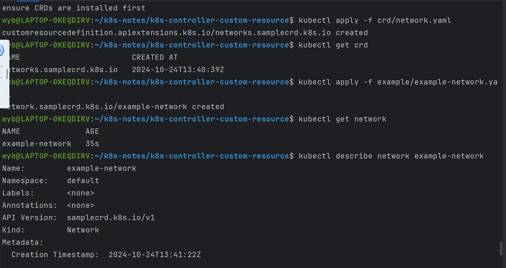
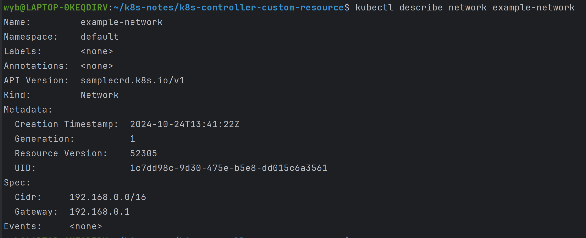
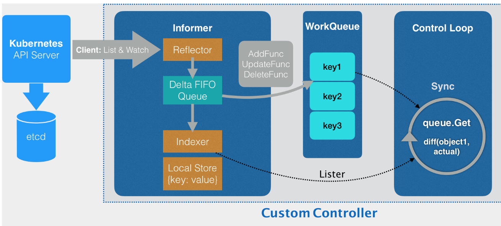
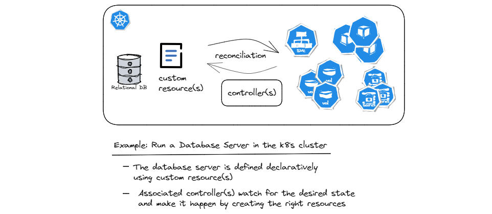

# 声明式API与Kubernetes编程范式

## 命令式
Kubernetes的API对象例如Pod、Service、Deployment等，都是通过YAML文件来定义的，这种方式称为声明式API。这些 API 对象，有的是用来描述应用，有的则是为应用提供各种各样的服务。

举个例子。我们知道，Docker Swarm 的编排操作都是基于命令行的，比如：
```
$ docker service create --name nginx --replicas 2  nginx
$ docker service update --image nginx:1.7.9 nginx
```

像这样的两条命令，就是用 Docker Swarm 启动了两个 Nginx 容器实例。其中，第一条 create 命令创建了这两个容器，而第二条 update 命令则把它们“滚动更新”为了一个新的镜像。

对于这种使用方式，我们称为命令式命令行操作。

而在k8s中，YAML文件如下：
```yaml
apiVersion: apps/v1
kind: Deployment
metadata:
  name: nginx-deployment
spec:
  selector:
    matchLabels:
      app: nginx
  replicas: 2
  template:
    metadata:
      labels:
        app: nginx
    spec:
      containers:
      - name: nginx
        image: nginx
        ports:
        - containerPort: 80
```
如果我们想修改nginx镜像的版本，我们可以修改这个 YAML 文件里的 Pod 模板部分，把 Nginx 容器的镜像改成 1.7.9，如下所示：
```yaml
...
    spec:
      containers:
      - name: nginx
        image: nginx:1.7.9
```
在使用命令完成这个 Deployment 的更新：
```
$ kubectl replace -f nginx.yaml
```
上述的方式称为命令式配置文件操作。

也就是说，它的处理方式，其实跟前面 Docker Swarm 的两句命令，没什么本质上的区别。只不过，它是把 Docker 命令行里的参数，写在了配置文件里而已。

## 声明式API
kubectl apply 命令才是声明式API。 kube-apiserver 在响应命令式请求（比如，kubectl replace）的时候，一次只能处理一个写请求，否则会有产生冲突的可能。而对于声明式请求（比如，kubectl apply），一次能处理多个写操作，并且具备 Merge 能力。

在 Kubernetes 项目中，一个 API 对象在 Etcd 里的完整资源路径，是由：Group（API 组）、Version（API 版本）和 Resource（API 资源类型）三个部分组成的。

通过这样的结构，整个 Kubernetes 里的所有 API 对象，实际上就可以用如下的树形结构表示出来：

从图中可以看出Kubernetes 里 API 对象的组织方式，其实是层层递进的。

```yaml
apiVersion: batch/v2alpha1
kind: CronJob
...
```
在这个 YAML 文件中，“CronJob”就是这个 API 对象的资源类型（Resource），“batch”就是它的组（Group），v2alpha1 就是它的版本（Version）。

当提交了这个 YAML 文件之后，Kubernetes 就会把这个 YAML 文件里描述的内容，转换成 Kubernetes 里的一个 CronJob 对象。

首先，Kubernetes 会匹配 API 对象的组。

需要明确的是，对于 Kubernetes 里的核心 API 对象，比如：Pod、Node 等，是不需要 Group 的（即：它们 Group 是“”）。所以，对于这些 API 对象来说，Kubernetes 会直接在 /api 这个层级进行下一步的匹配过程。
而对于 CronJob 等非核心 API 对象来说，Kubernetes 就必须在 /apis 这个层级里查找它对应的 Group，进而根据“batch”这个 Group 的名字，找到 /apis/batch。
不难发现，这些 API Group 的分类是以对象功能为依据的，比如 Job 和 CronJob 就都属于“batch” （离线业务）这个 Group。
然后，Kubernetes 会进一步匹配到 API 对象的版本号。

对于 CronJob 这个 API 对象来说，Kubernetes 在 batch 这个 Group 下，匹配到的版本号就是 v2alpha1。

在 Kubernetes 中，同一种 API 对象可以有多个版本，这正是 Kubernetes 进行 API 版本化管理的重要手段。这样，比如在 CronJob 的开发过程中，对于会影响到用户的变更就可以通过升级新版本来处理，从而保证了向后兼容。

最后，Kubernetes 会匹配 API 对象的资源类型。

在前面匹配到正确的版本之后，Kubernetes 就知道，我要创建的原来是一个 /apis/batch/v2alpha1 下的 CronJob 对象。

这时候，APIServer 就可以继续创建这个 CronJob 对象了。为了方便理解，如下所示流程图来阐述这个创建过程：

1. 首先，当发起了创建 CronJob 的 POST 请求之后，编写的 YAML 的信息就被提交给了 APIServer。 而 APIServer 的第一个功能，就是过滤这个请求，并完成一些前置性的工作，比如授权、超时处理、审计等。
2. 然后，请求会进入 MUX 和 Routes 流程。MUX 和 Routes 是 APIServer 完成 URL 和 Handler 绑定的场所。而 APIServer 的 Handler 要做的事情，就是找到对应的 CronJob 类型定义。
3. 接着，APIServer 最重要的职责就来了：根据这个 CronJob 类型定义，使用用户提交的 YAML 文件里的字段，创建一个 CronJob 对象。而在这个过程中，APIServer 会进行一个 Convert 工作，即：把用户提交的 YAML 文件，转换成一个叫作 Super Version 的对象，它正是该 API 资源类型所有版本的字段全集。这样用户提交的不同版本的 YAML 文件，就都可以用这个 Super Version 对象来进行处理了。
4. 接下来，APIServer 会先后进行 Admission() 和 Validation() 操作。比如Admission Controller 和 Initializer，就都属于 Admission 的内容。而 Validation，则负责验证这个对象里的各个字段是否合法。这个被验证过的 API 对象，都保存在了 APIServer 里一个叫作 Registry 的数据结构中。也就是说，只要一个 API 对象的定义能在 Registry 里查到，它就是一个有效的 Kubernetes API 对象。
5. 最后，APIServer 会把验证过的 API 对象转换成用户最初提交的版本，进行序列化操作，并调用 Etcd 的 API 把它保存起来。

## CRD(Custom Resource Definition)
k8s拥有一些内置的资源，比如说Pod，Deployment，ReplicaSet等等，针对每种资源的每个api，k8s都内置了自己的逻辑。

但是有些复杂的逻辑，想要放在k8s中去运行，就要进行一些的拓展。

而CRD则提供了这种拓展的方式，使用户可以自定义新的资源，以扩展k8s的功能。

**使用CRD可以在不修改k8s源代码的基础上方便的扩展k8s的功能。**

例如下面的example-network.yaml
```yaml
apiVersion: samplecrd.k8s.io/v1
kind: Network
metadata:
  name: example-network
spec:
  cidr: "192.168.0.0/16"
  gateway: "192.168.0.1"
```

上面的这个 YAML 文件，就是一个具体的“自定义 API 资源”实例，也叫 CR（Custom Resource）。而为了能够让 Kubernetes 认识这个 CR，你就需要让 Kubernetes 明白这个 CR 的宏观定义是什么，也就是 CRD（Custom Resource Definition）。

network.yaml
```yaml
apiVersion: apiextensions.k8s.io/v1beta1
kind: CustomResourceDefinition
metadata:
  name: networks.samplecrd.k8s.io
spec:
  group: samplecrd.k8s.io
  version: v1
  names:
    kind: Network
    plural: networks   # 复数形式
  scope: Namespaced    # 定义的这个 Network 是一个属于 Namespace 的对象，类似于 Pod
```
这就是一个 Network API 资源类型的 API 部分的宏观定义了。
接下来，我还需要让 Kubernetes“认识”这种 YAML 文件里描述的“网络”部分，比如“cidr”（网段），“gateway”（网关）这些字段的含义。

使用 Kubernetes 提供的代码生成工具，为上面定义的 Network 资源类型自动生成 clientset、informer 和 lister。其中，clientset 就是操作 Network 对象所需要使用的客户端，而 informer 和 lister 这两个包的主要功能，
```
# 代码生成的工作目录，也就是我们的项目路径
$ ROOT_PACKAGE="github.com/resouer/k8s-controller-custom-resource"
# API Group
$ CUSTOM_RESOURCE_NAME="samplecrd"
# API Version
$ CUSTOM_RESOURCE_VERSION="v1"
 
# 安装 k8s.io/code-generator
$ go get -u k8s.io/code-generator/...
$ cd $GOPATH/src/k8s.io/code-generator
 
# 执行代码自动生成，其中 pkg/client 是生成目标目录，pkg/apis 是类型定义目录
$ ./generate-groups.sh all "$ROOT_PACKAGE/pkg/client" "$ROOT_PACKAGE/pkg/apis" "$CUSTOM_RESOURCE_NAME:$CUSTOM_RESOURCE_VERSION"
```



### 自定义控制器工作原理

1. 控制器要做的第一件事，是从 Kubernetes 的 APIServer 里获取它所关心的对象，也就是自定义的 Network 对象。这个操作，依靠的是一个叫作 Informer的代码库完成的。Informer 与 API 对象是一一对应的，所以传递给自定义控制器的，正是一个 Network 对象的 Informer（Network Informer）。
2. 





### 使用
在 Kubernetes (k8s) 上部署 MySQL 通常不需要自定义资源，因为可以通过 Kubernetes 提供的标准资源来完成部署。以下是一些常用的 Kubernetes 资源，它们可以用于部署和管理 MySQL 数据库：
1. ConfigMap：用于存储配置文件，比如 MySQL 的配置文件my.cnf。
2. Secret：用于存储敏感信息，比如 MySQL 的密码。
3. PersistentVolume (PV) 和 PersistentVolumeClaim (PVC)：用于数据持久化，确保数据库数据在 Pod 重启后依然可用。
4. Deployment：定义了应用的声明周期，确保指定数量的 Pod 副本始终运行。
5. StatefulSet：适用于需要持久化存储和唯一网络标识的应用，比如数据库。
6. Service：定义了访问应用的方式，比如通过 ClusterIP、NodePort 或 LoadBalancer。

使用这些标准资源，你可以创建一个 MySQL 部署，它将包括配置文件、密码、存储、部署和网络访问。如果你有特殊的需求，比如特定的存储类型或高级网络配置，你可能需要配置特定的参数或使用第三方解决方案，但这些通常也通过 Kubernetes 的标准资源来实现，而不需要自定义资源。

### 编写自定义控制器
自定义控制器是一个独立的应用程序，它使用 Kubernetes 客户端库来监听 CRD 资源的变化。控制器的逻辑是你自己编写的，它定义了当 CRD 资源发生变化时应该执行的操作。

以下是几种编写crd控制器可能所需要的工具：

1. Kubebuilder:
Kubebuilder 是一个基于 Go 语言的项目，用于快速开发 Kubernetes 控制器。尽管 Kubebuilder 本身是用 Go 编写的，但它提供了一个生成器工具，可以帮助你通过简单的命令行操作生成控制器的代码。你可以使用 Kubebuilder 来生成基本的控制器框架，然后通过定义自定义资源的 API 规范和控制逻辑来自定义控制器行为。
2. Operator SDK:
Operator SDK 是另一个流行的工具，它支持使用 Go、Ansible 或者 Helm 来编写 Kubernetes 的自定义操作符（Operators）。你可以通过 Operator SDK 生成基础代码框架，然后在生成的框架基础上，通过配置和定制来实现自定义资源的控制器逻辑。
3. Helm Charts:
尽管 Helm 主要用于应用程序的打包和部署，但它也可以在 Chart 中包含自定义资源的定义。通过编写 Helm Chart，你可以定义和管理包含自定义资源的 Kubernetes 应用程序，而无需编写额外的控制器代码。
4. Operator Framework:
Operator Framework 是一个开源的框架，支持使用多种语言和工具来编写和部署 Kubernetes 操作符。你可以使用 Operator Framework 的相关组件来定义和管理自定义资源的控制逻辑，而无需自行编写控制器代码。

