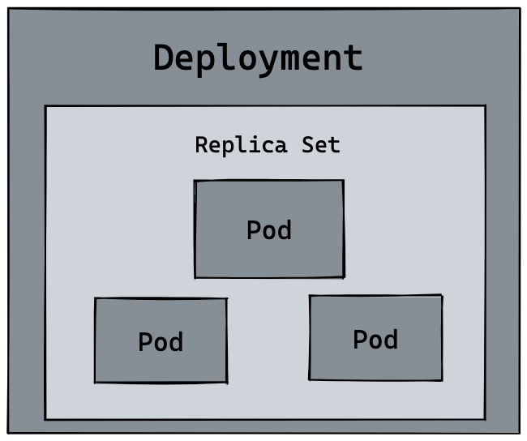
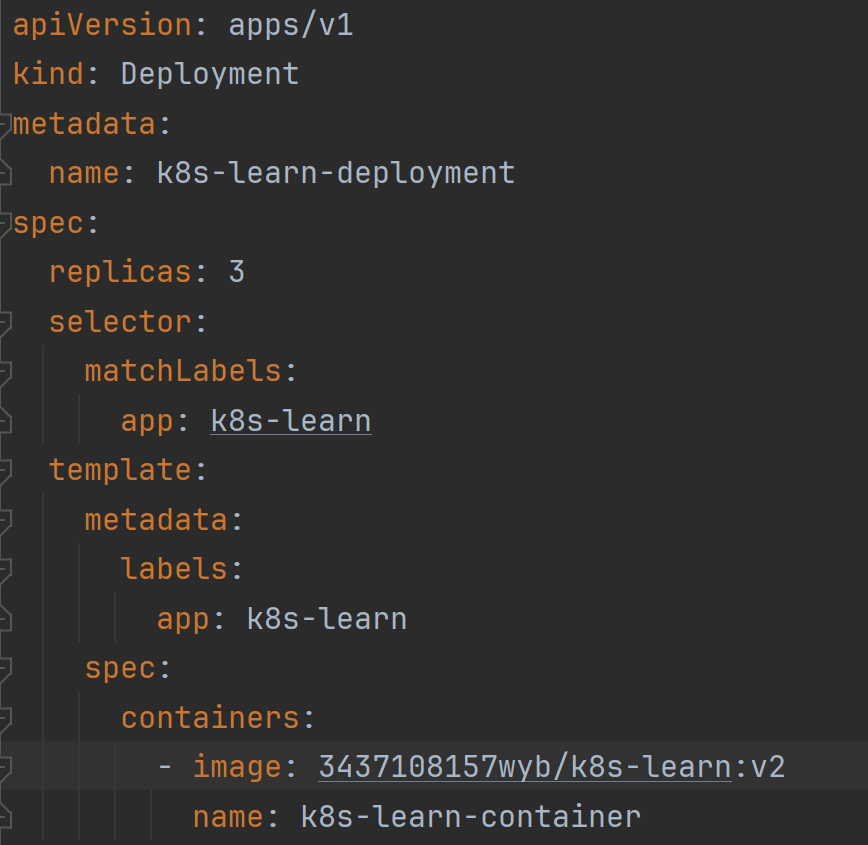
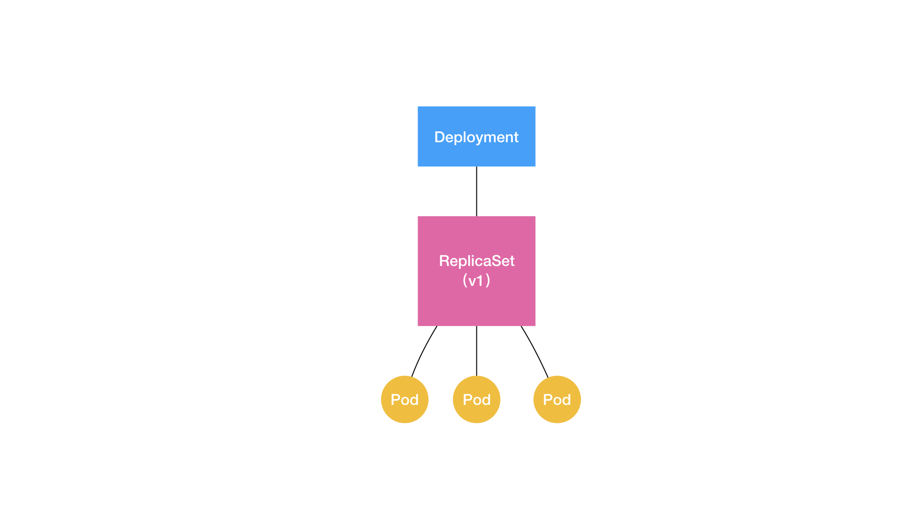
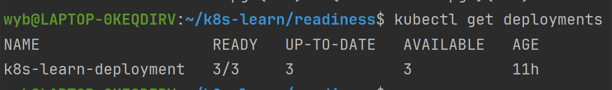
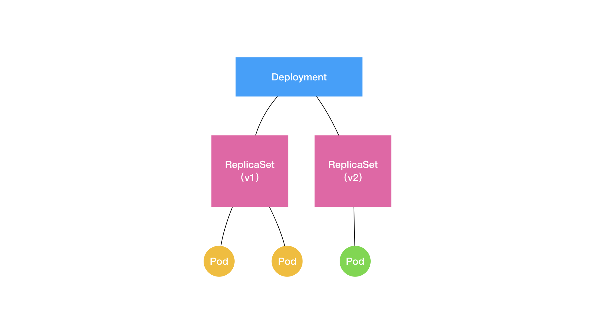

## Deployment(deploy)

### 简介
Deployment是⼀种Pod管理⽅式，它可以指挥Kubernetes 如何创建和更
新你部署的应⽤实例创建Deployment后，Kubernetes master会将应⽤
程序调度到集群中的各个节点上，⼀般⽤来部署⽆状态应⽤。



Deployment实现了Kubernetes项目中一个非常重要的功能：Pod 的“水平扩展 / 收缩”（horizontal scaling out/in）。
举个例子，如果你更新了 Deployment 的 Pod 模板（比如，修改了容器的镜像），那么 Deployment 就需要遵循一种叫作“滚动更新”（rolling update）的方式，来升级现有的容器。

而这个能力的实现，依赖的是 Kubernetes 项目中的一个非常重要的概念（API 对象）：ReplicaSet。

### ReplicaSet



ReplicaSet 是 Kubernetes 项目中的一个 API 对象，它的作用是确保集群中始终有指定数量的 Pod 副本在运行从这个 YAML 文件中，我们可以看到，一个 ReplicaSet 对象，其实就是由副本数目的定义和一个 Pod 模板组成的。不难发现，它的定义其实是 Deployment 的一个子集。
更重要的是，Deployment 控制器实际操纵的，正是这样的 ReplicaSet 对象，而不是 Pod 对象。


ReplicaSet 负责通过“控制器模式”，保证系统中 Pod 的个数永远等于指定的个数, 也就是说，ReplicaSet 会根据用户定义的 Pod 副本数，来创建或销毁 Pod。


+ **UP-TO-DATE：** 代表当前 ReplicaSet 中的 Pod 的数量，与用户定义的 Pod 副本数相等。
+ **AVAILABLE：** 代表当前可用的 Pod 的数量，也就是说，这些 Pod 是健康的，可以正常提供服务。
+ **UNAVAILABLE：** 代表当前不可用的 Pod 的数量，也就是说，这些 Pod 是不健康的，无法提供服务。
+ **DESIRED：** 代表用户定义的 Pod 副本数。
+ **CURRENT：** 代表当前 ReplicaSet 中的 Pod 的数量。
+ **READY：** 代表当前就绪的 Pod 的数量。


### Deployment命令
```shell
# 创建Deployment
kubectl create -f deployment.yaml
# 查看Deployment
kubectl get deployment
# 查看Deployment详细信息
kubectl describe deployment <deployment-name>
# 删除Deployment
kubectl delete deployment <deployment-name>
# 查看Deployment日志
kubectl logs <deployment-name>
# 进入Deployment
kubectl exec -it <deployment-name> -- /bin/bash
# 将本地主机的一个端口转发到 Kubernetes 集群中的 Deployment 的一个端口
kubectl port-forward <deployment-name> 8080:80
# 将本地主机的一个目录挂载到 Kubernetes 集群中的 Deployment 中
kubectl cp /path/to/local/file <deployment-name>:/path/to/deployment/file
```

### Deployment不足之处
Deployment 实际上并不足以覆盖所有的应用编排问题，它只是一个 Pod 的管理器，而不是一个应用的管理器。它认为，一个应用的所有 Pod，是完全一样的。所以，它们互相之间没有顺序，也无所谓运行在哪台宿主机上。需要的时候，Deployment 就可以通过 Pod 模板创建新的 Pod；不需要的时候，Deployment 就可以“杀掉”任意一个 Pod。
但是，在实际的场景中，并不是所有的应用都可以满足这样的要求。尤其是分布式应用，它的多个实例之间，往往有依赖关系，比如：主从关系、主备关系。还有就是数据存储类应用，它的多个实例，往往都会在本地磁盘上保存一份数据。而这些实例一旦被杀掉，即便重建出来，实例与数据之间的对应关系也已经丢失，从而导致应用失败。所以，这种实例之间有不对等关系，以及实例对外部数据有依赖关系的应用，就被称为“有状态应用”（Stateful Application）。


### StatefulSet
StatefulSet 是 Kubernetes 项目中的一个 API 对象，它的作用是确保集群中的有状态应用（Stateful Application）始终有指定数量的 Pod 副本在运行。
StatefulSet 与 Deployment 的最大区别在于，StatefulSet 为每个 Pod 副本维护了一个唯一的标识符（序号），并且这个标识符是稳定的，不会因为 Pod 的重建而改变。这样一来，StatefulSet 就可以保证每个 Pod 副本都有一个唯一的网络标识符（DNS 名称），并且这个标识符是持久的，不会因为 Pod 的重建而改变。
StatefulSet 的设计其实非常容易理解。它把真实世界里的应用状态，抽象为了两种情况：
+ **拓扑状态**：这种情况意味着，应用的多个实例之间不是完全对等的关系。这些应用实例，必须按照某些顺序启动，比如应用的主节点 A 要先于从节点 B 启动。而如果你把 A 和 B 两个 Pod 删除掉，它们再次被创建出来时也必须严格按照这个顺序才行。并且，新创建出来的 Pod，必须和原来 Pod 的网络标识一样，这样原先的访问者才能使用同样的方法，访问到这个新 Pod。
+ **存储状态**：这种情况意味着，应用的多个实例分别绑定了不同的存储数据。对于这些应用实例来说，Pod A 第一次读取到的数据，和隔了十分钟之后再次读取到的数据，应该是同一份，哪怕在此期间 Pod A 被重新创建过。这种情况最典型的例子，就是一个数据库应用的多个存储实例。

**StatefulSet 的核心功能，就是通过某种方式记录这些状态，然后在 Pod 被重新创建时，能够为新 Pod 恢复这些状态**


### StatefulSet命令
```shell
# 创建StatefulSet
kubectl create -f statefulset.yaml
# 查看StatefulSet
kubectl get statefulset
# 查看StatefulSet详细信息
kubectl describe statefulset <statefulset-name>
# 删除StatefulSet
kubectl delete statefulset <statefulset-name>
# 查看StatefulSet日志
kubectl logs <statefulset-name>
# 进入StatefulSet
kubectl exec -it <statefulset-name> -- /bin/bash
# 将本地主机的一个端口转发到 Kubernetes 集群中的 StatefulSet 的一个端口
kubectl port-forward <statefulset-name> 8080:80
# 将本地主机的一个目录挂载到 Kubernetes 集群中的 StatefulSet 中
kubectl cp /path/to/local/file <statefulset-name>:/path/to/statefulset/file
```


