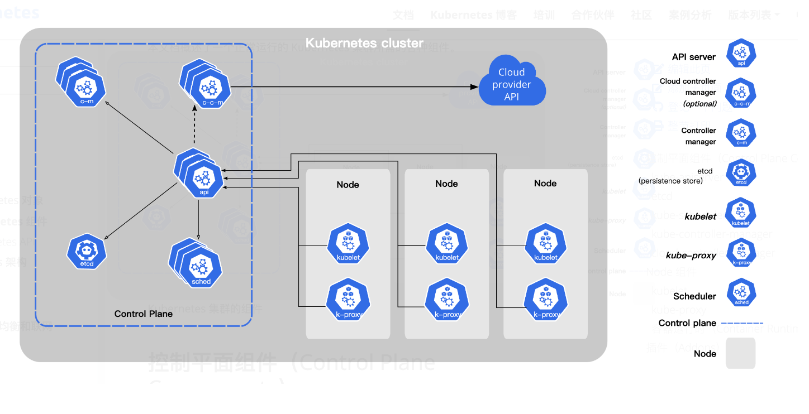
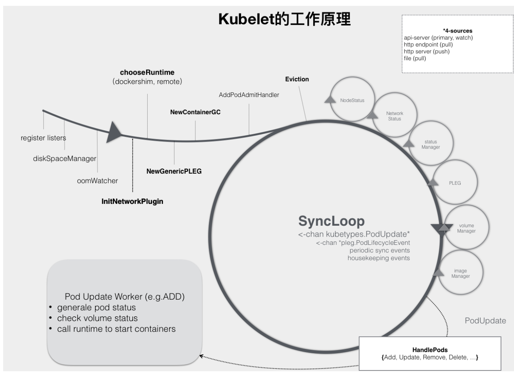
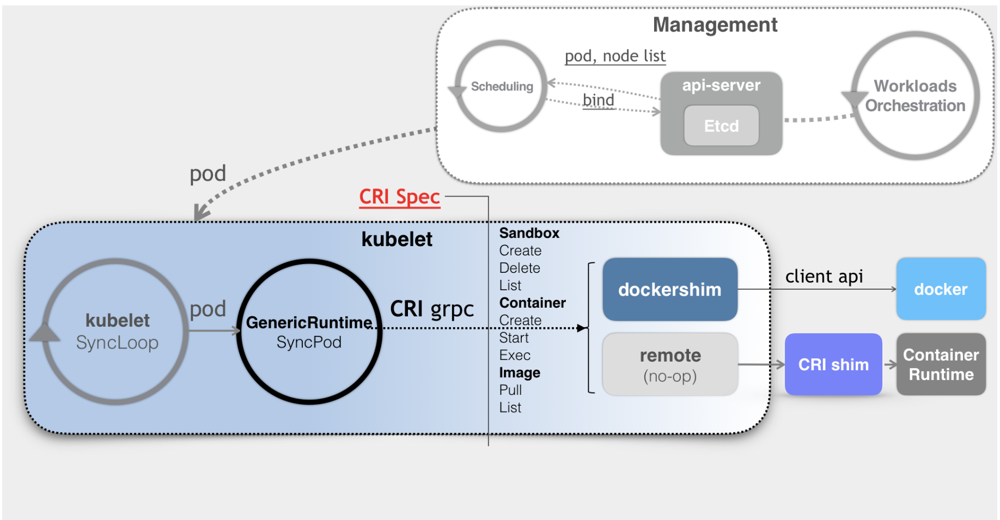
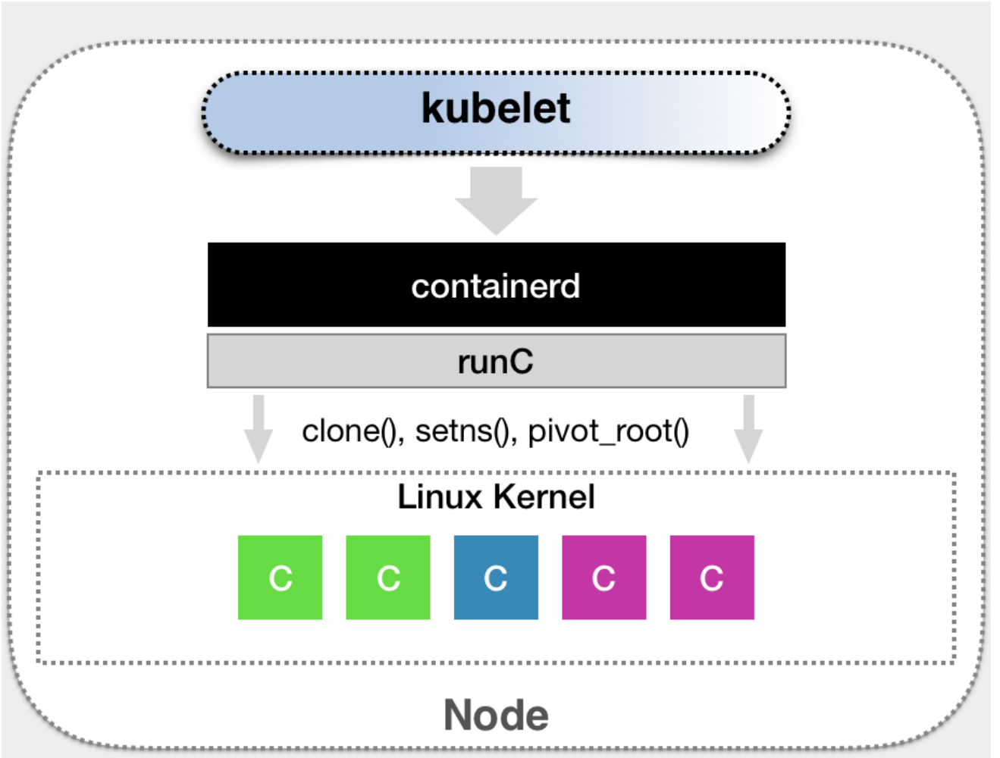

# 架构

## 控制平面：Control Plane：
控制平面由一系列组件构成，会为集群做出全局决策，比如资源的调度。 以及检测和响应集群事件，例如当不满足部署的 replicas 字段时，要启动新的Pod。

## 节点：node
节点是Kubernetes集群中的工作机器，可以是物理机或虚拟机。每个节点都运行着容器运行时（如Docker）、kubelet和kube-proxy。

kubernetes中并没有针对节点做分类，每个节点是什么类型取决于在这个节点上部署的组件，但是我们一般将控

制平面相关的组件单独的部署在一台或者多台机器上以便于拓展和管理。

这样就变成了经典的 master slave 架构模式，我们可以把kubernetes中的组件分为两类：主节点（master node），工作节点（worker node）。下面分别

介绍这两种节点以及其相关组件。

## 主节点：Master node:
主节点是Kubernetes集群的控制中心，负责管理集群的状态和运行。它负责调度决策、集群的全局状态管理以及与集群中所有节点的通信。

主节点上运行着以下5个关键的Kubernetes组件：

1. kube-apiserver：集群的前端服务，是集群所有组件通信的入口点。
2. etcd：一个轻量级、分布式键值存储系统，用于存储集群的所有数据。
3. kube-scheduler：负责决定将新的Pods（容器的集合）调度到哪个节点上运行。
4. kube-controller-manager：运行集群中的各种控制器，例如节点控制器、副本控制器等。
5. cloud-controller-manager：如果集群运行在云平台上，这个组件会运行云平台特定的控制循环。

### kube-apiserver: api请求入口
该组件负责公开了 Kubernetes API，负责处理接受请求的工作。

这是Kubernetes API的服务器，作为集群的前端服务，提供集群管理的RESTful API接口。

所有Kubernetes组件（包括kubectl命令行工具、调度器、控制器管理器等）都通过API服务器与etcd通信。

它是集群所有组件通信的中心点，负责处理外部请求并代理到其他组件。

### etcd：信息存储服务
一致且高可用的键值存储，用作 Kubernetes 所有集群数据的后台数据库。

Kubernetes使用etcd存储所有集群数据，包括Pods、服务（Services）、节点（Nodes）等信息。

### kube-scheduler：调度器
kube-scheduler 负责监视新创建的、未指定运行节点（node）的 Pods， 并选择节点来让 Pod 在上面运行。

调度决策考虑的因素包括单个 Pod 及 Pods 集合的资源需求、软硬件及策略约束、 亲和性及反亲和性规范、数据位置、工作负载间的干扰及最后时限。

### kube-controller-manager：控制器
控制器管理器运行集群中的各种控制器进程。控制器是Kubernetes中的后台进程，负责运行集群中的各种自动化任务，例如节点故障检测、Pod副本管理等。
从逻辑上讲， 每个控制器都是一个单独的进程， 但是为了降低复杂性，它们都被编译到同一个可执行文件，并在同一个进程中运行。

有许多不同类型的控制器。以下是一些例子：
+ 节点控制器（Node Controller）：负责在节点出现故障时进行通知和响应
+ 任务控制器（Job Controller）：监测代表一次性任务的 Job 对象，然后创建 Pod 来运行这些任务直至完成
+ 端点分片控制器（EndpointSlice controller）：填充端点分片（EndpointSlice）对象（以提供 Service 和 Pod 之间的链接）。
+ 服务账号控制器（ServiceAccount controller）：为新的命名空间创建默认的服务账号（ServiceAccount）。

### cloud-controller-manager：云平台管理器
云控制器管理器（Cloud Controller Manager）允许将你的集群连接到云提供商的 API 之上， 并将与该云平台交互的组件同与你的集群交互的组件分离开来。

cloud-controller-manager 仅运行特定于云平台的控制器。 因此如果你在自己的环境中运行 Kubernetes，或者在本地计算机中运行学习环境， 所部署的集群不需要有云控制器管理器。

与 kube-controller-manager类似，cloud-controller-manager将若干逻辑上独立的控制回路组合到同一个可执行文件中， 供你以同一进程的方式运行。 你可以对其执行水平扩容（运行不止一个副本）以提升性能或者增强容错能力。

下面的控制器都包含对云平台驱动的依赖：
+ 节点控制器（Node Controller）：用于在节点终止响应后检查云提供商以确定节点是否已被删除
+ 路由控制器（Route Controller）：用于在底层云基础架构中设置路由
+ 服务控制器（Service Controller）：用于创建、更新和删除云提供商负载均衡器

## 工作节点：Worker Node:
工作节点（Worker Node）在Kubernetes集群中负责运行容器化的应用。

工作节点的主要任务是执行主节点的指令，比如启动、停止容器，以及根据主节点的调度决策来运行应用。

工作节点上运行着以下3个关键的Kubernetes组件：
1. kubelet：在每个节点上运行，负责维护容器的生命周期，如启动容器、监控容器健康状态等。
2. kube-proxy：在每个节点上运行，负责网络代理，确保集群内部的网络通信。
3. Container Runtime：负责实际运行容器。可以是Docker或者其他任何容器运行时。

### kubelet工作原理
Kubelet是Kubernetes集群中每个节点的代理，负责维护容器的生命周期。它与主节点上的API Server通信，并执行以下主要任务：
1. **容器生命周期管理**：Kubelet接收来自API Server的指令，启动、停止、更新或删除容器。
2. **健康检查**：Kubelet定期对容器进行健康检查，以确保它们按照预期运行。如果容器失败，Kubelet会根据配置尝试重启容器。
3. **资源管理**：Kubelet监控节点的资源使用情况，如CPU和内存，并确保容器不会超出其分配的资源限制。
4. **容器镜像管理**：Kubelet负责拉取容器镜像，并在需要时更新它们。
5. **数据卷管理**：Kubelet挂载Pods所需的数据卷，包括持久化卷和配置映射。
6. **节点状态报告**：Kubelet定期向API Server报告节点的状态，包括资源使用情况、容器状态和节点健康状况。

kubelet 的工作核心，就是一个控制循环，即：SyncLoop（图中的大圆圈）。而驱动这个控制循环运行的事件，包括四种：
1. Pod 更新事件；
2. Pod 生命周期变化；
3. kubelet 本身设置的执行周期；
4. 定时的清理事件。

所以，跟其他控制器类似，kubelet 启动的时候，要做的第一件事情，就是设置 Listers，也就是注册它所关心的各种事件的 Informer。这些 Informer，就是 SyncLoop 需要处理的数据的来源。

此外，kubelet 还负责维护着很多很多其他的子控制循环。这些控制循环的名字，一般被称作某某 Manager，比如 Volume Manager、Image Manager、Node Status Manager 等等。

这些控制循环的责任，就是通过控制器模式，完成 kubelet 的某项具体职责。比如 Node Status Manager，就负责响应 Node 的状态变化，然后将 Node 的状态收集起来，并通过 Heartbeat 的方式上报给 APIServer。再比如 CPU Manager，就负责维护该 Node 的 CPU 核的信息，以便在 Pod 通过 cpuset 的方式请求 CPU 核的时候，能够正确地管理 CPU 核的使用量和可用量。

kubelet 也是通过 Watch 机制，监听了与自己相关的 Pod 对象的变化。当然，这个 Watch 的过滤条件是该 Pod 的 nodeName 字段与自己相同。kubelet 会把这些 Pod 的信息缓存在自己的内存里。

而当一个 Pod 完成调度、与一个 Node 绑定起来之后， 这个 Pod 的变化就会触发 kubelet 在控制循环里注册的 Handler，也就是上图中的 HandlePods 部分。此时，通过检查该 Pod 在 kubelet 内存里的状态，kubelet 就能够判断出这是一个新调度过来的 Pod，从而触发 Handler 里 ADD 事件对应的处理逻辑。

在具体的处理过程当中，kubelet 会启动一个名叫 Pod Update Worker 的、单独的 Goroutine 来完成对 Pod 的处理工作。

比如，如果是 ADD 事件的话，kubelet 就会为这个新的 Pod 生成对应的 Pod Status，检查 Pod 所声明使用的 Volume 是不是已经准备好。然后，调用下层的容器运行时（比如 Docker），开始创建这个 Pod 所定义的容器。

而如果是 UPDATE 事件的话，kubelet 就会根据 Pod 对象具体的变更情况，调用下层容器运行时进行容器的重建工作。
> kubelet 调用下层容器运行时的执行过程，并不会直接调用 Docker 的 API，而是通过一组叫作 CRI（Container Runtime Interface，容器运行时接口）的 gRPC 接口来间接执行的。

### Kube-proxy：网络代理：
是Kubernetes集群中的网络代理，负责在集群内部和外部之间路由网络流量。它在每个节点上运行，并执行以下主要任务：
1. **服务发现**：Kube-proxy监听API Server，以了解服务和端点的变化，并相应地更新其路由规则。
2. **负载均衡**：Kube-proxy在多个Pods之间分配进入的网络流量，确保服务请求被均匀地分发到后端的Pods。
3. **网络策略实施**：Kube-proxy根据定义的网络策略规则，控制Pods之间的网络通信。
4. **IPTABLES规则管理**：Kube-proxy使用IPTABLES规则来管理网络流量，确保流量正确地路由到目标Pods。
5. **服务和端点同步**：Kube-proxy确保其内部的路由表与API Server中定义的服务和端点保持同步。
6. **连接跟踪**：Kube-proxy跟踪每个连接的状态，以支持连接的持久化和正确的负载均衡。

Kubelet和kube-proxy共同工作，确保Kubernetes集群的节点能够高效地运行和管理容器，同时提供稳定和可预测的网络通信。通过这些组件，Kubernetes能够实现其核心功能，如服务发现、负载均衡和自动扩展。

### Container Runtime：容器运行时：
容器运行时负责运行容器、管理容器生命周期和提供容器隔离环境。

Kubernetes支持多种容器运行时，包括Docker、containerd、CRI-O等。

任何满足Kubernetes CRI (容器运行环境接口)的容器运行时工具都可以被接受。

### CRI:
在 Kubernetes 中，CRI 是指容器运行时接口（Container Runtime Interface）。CRI 是一个插件接口，用于使 Kubernetes Kubelet 与不同的容器运行时（如 Docker、containerd、CRI-O 等）进行交互。它定义了一组标准化的 API，使 Kubernetes 可以管理和运行容器，而不必依赖特定的容器运行时实现。

组成部分:
1. **gRPC API**：CRI 使用 gRPC 定义其 API。gRPC 是一种高性能、开源和通用的 RPC 框架，便于不同语言之间的通信。
2. **Protocol Buffers**：gRPC API 使用 Protocol Buffers（protobuf）作为其接口定义语言（IDL）。这使得接口既高效又便于版本控制。

组件：
+ Container Runtime：实际运行和管理容器的底层软件，如 Docker、containerd 和 CRI-O。
+ Image Service：负责拉取、管理和删除容器镜像。
+ Container Manager：负责容器的生命周期管理，包括创建、启动、停止和删除容器。

主要 CRI 实现：
1. Docker Shim：最初的实现，允许 Kubelet 通过 dockershim 直接与 Docker 容器运行时交互。已经逐步淘汰。
2. containerd：一个高性能的容器运行时，专为 Kubernetes 设计。
3. CRI-O：一个轻量级的容器运行时，专为 Kubernetes 环境设计，完全实现了 CRI。

作用：
+ 解耦：通过定义标准接口，Kubernetes 可以与多种容器运行时兼容，使其更具灵活性和可扩展性。
+ 简化集成：开发者只需实现 CRI 接口，就可以将新的容器运行时集成到 Kubernetes 中。
总的来说，CRI 是 Kubernetes 体系结构中的一个重要组成部分，它使得 Kubernetes 能够灵活地支持多种容器运行时，实现容器的标准化管理和操作

#### containerd
将 Kubernetes 发出的 CRI 请求，转换成对 containerd 的调用，然后创建出 runC 容器。而 runC 项目，才是负责执行我们前面讲解过的设置容器 Namespace、Cgroups 和 chroot 等基础操作的组件。所以，这几层的组合关系，可以用如下所示的示意图来描述。

CRI 设计的一个重要原则，就是确保这个接口本身，只关注容器，不关注 Pod。
1. Pod 是 Kubernetes 的编排概念，而不是容器运行时的概念。所以，我们就不能假设所有下层容器项目，都能够暴露出可以直接映射为 Pod 的 API。
2. 如果 CRI 里引入了关于 Pod 的概念，那么接下来只要 Pod API 对象的字段发生变化，那么 CRI 就很有可能需要变更。

