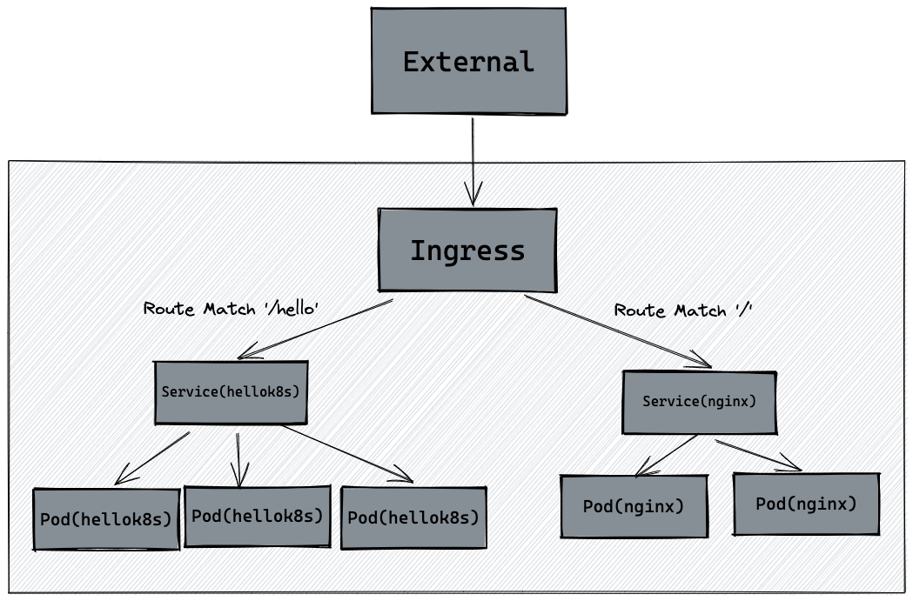

## Ingress

**本质上，Ingress是一种七层负载均衡的抽象。**

> 假设有一个L7负载均衡器在HTTP层进行负载均衡。客户端请求 http://example.com/api/v1 或 http://example.com/images， 负载均衡器根据URL路径将请求分发到不同的后端服务器组。
请求 http://example.com/api/v1 -> 负载均衡器 (检查URL路径) -> API服务器
请求 http://example.com/images -> 负载均衡器 (检查URL路径) -> 图像服务器
Ingress 是对集群中服务的外部访问进行管理的 API 对象，典型的访问方式是 HTTP。
下面是 Ingress 的一个简单示例，可将所有流量都发送到同一 Service：


### 部署
```yaml
# 指定 Kubernetes API 的版本
apiVersion: networking.k8s.io/v1
# 指定资源的类型
kind: Ingress
# 包含资源的元数据
metadata:
  # 资源的名称
  name: minimal-ingress
  # 包含额外的配置注解
  annotations:
    # 用于 Nginx Ingress 控制器的重写目标路径配置
    nginx.ingress.kubernetes.io/rewrite-target: /
# 指定 Ingress 的规范
spec:
  # 指定 Ingress 控制器的名称
  ingressClassName: nginx-example
  # 定义路由规则
  rules:
  - http:
      # 定义 HTTP 协议的路由规则
      paths:
      - path: /testpath
        # 路径匹配类型，Prefix 表示匹配以 /testpath 开头的路径
        pathType: Prefix
        backend:
          # 定义请求的后端服务
          service:
            # 服务的名称
            name: test
            # 服务的端口号
            port:
              number: 80
```
这个配置文件可以用来设置一个简单的 Ingress 规则，使得所有访问到 /testpath 的 HTTP 请求都会被转发到名为 test 的服务的端口 80 上，并且请求的路径会被重写为 /。

### 控制器
Ingress 公开从集群外部到集群内服务的 HTTP 和 HTTPS 路由。 流量路由由 Ingress 资源上定义的规则控制。Ingress 可为 Service 提供外部可访问的 URL、负载均衡流量、 SSL/TLS，以及基于名称的虚拟托管。你必须拥有一个 Ingress 控制器才能满足 Ingress 的要求。 仅创建 Ingress 资源本身没有任何效果。Ingress 控制器通常负责通过负载均衡器来实现 Ingress。

与作为 kube-controller-manager 可执行文件的一部分运行的其他类型的控制器不同， Ingress 控制器不是随集群自动启动的。可选择最适合你的集群的 ingress 控制器实现。目前支持和维护AWS。GCE和NginxIngress 控制器。

### 实现

#### linux网络模型
通常，我们将虚拟机中的网络通信视为直接与以太网设备交互。

在 Linux 中，每个正在运行的进程都在一个网络命名空间内进行通信，该命名空间为逻辑网络堆栈提供了自己的路由、防火墙规则和网络设备。本质上，网络命名空间为命名空间内的所有进程提供了一个全新的网络堆栈。作为 Linux 用户，可以使用 ip 命令创建网络命名空间。

默认情况下，Linux 将每个进程分配给根网络命名空间以提供对外部世界的访问。


##### eth:
th0 是在类 Unix 操作系统（如 Linux 和 BSD）中常见的网络接口名称，表示第一个以太网网络接口。网络接口是连接计算机与网络的设备或端口，负责处理计算机与外部网络的通信。eth0 通常用于有线以太网连接，而在同一系统上，第二个以太网接口通常被命名为 eth1。

##### veth:
veth（Virtual Ethernet）是虚拟网络接口的一种，用于在网络命名空间之间创建虚拟网络连接。veth 设备成对出现，类似于一个虚拟网线的两端，一个接口的数据包会出现在另一个接口上。

