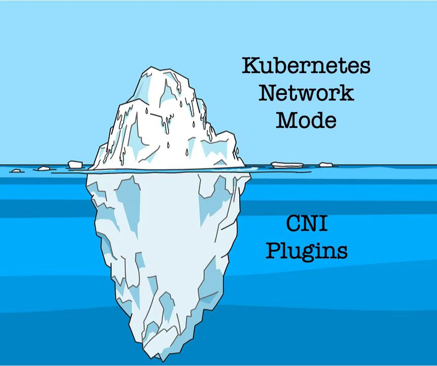
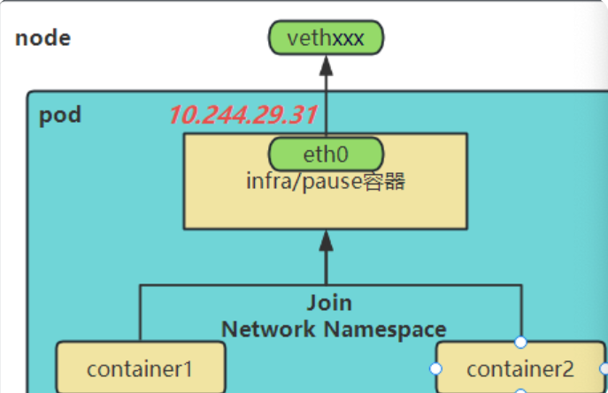
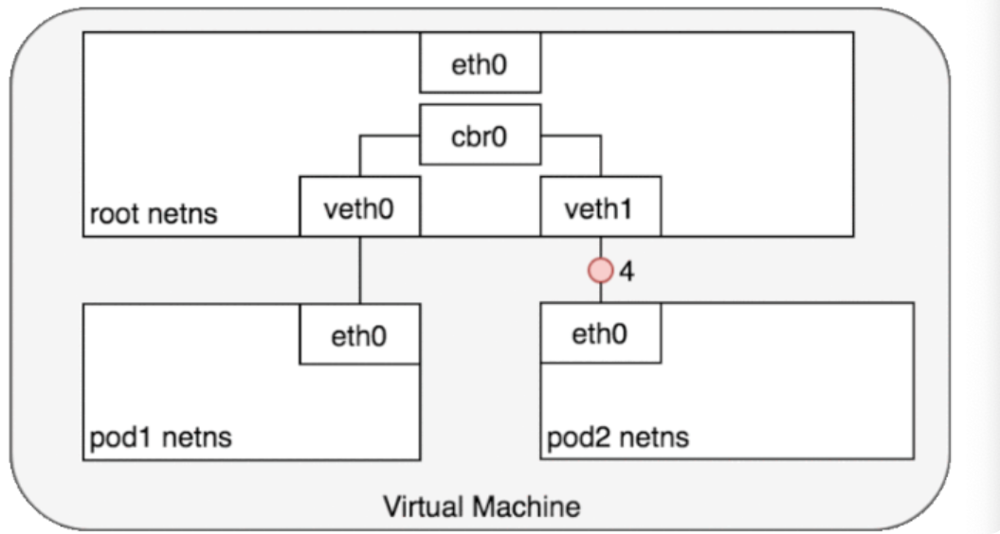
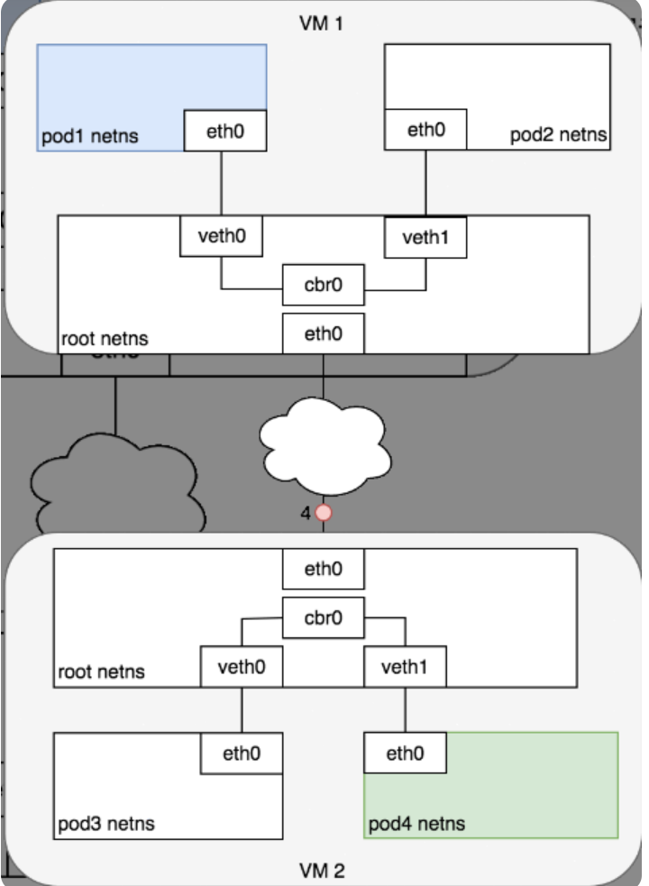
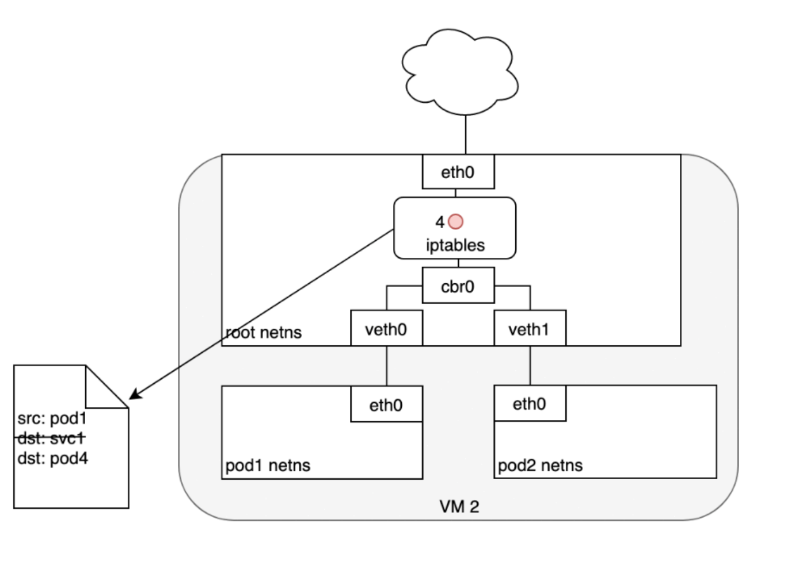
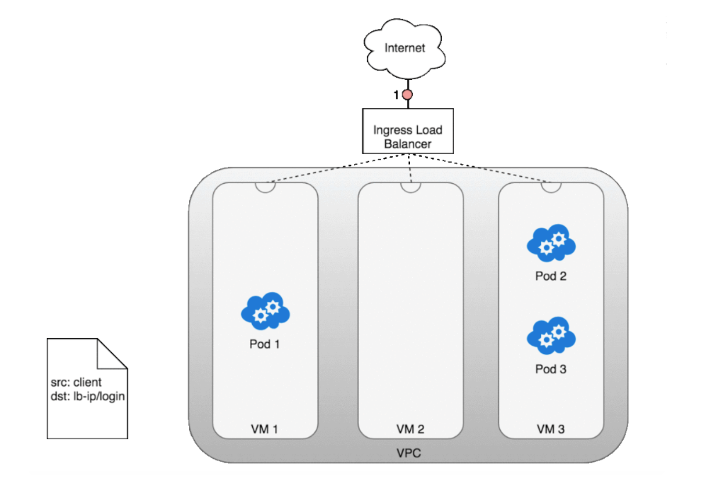
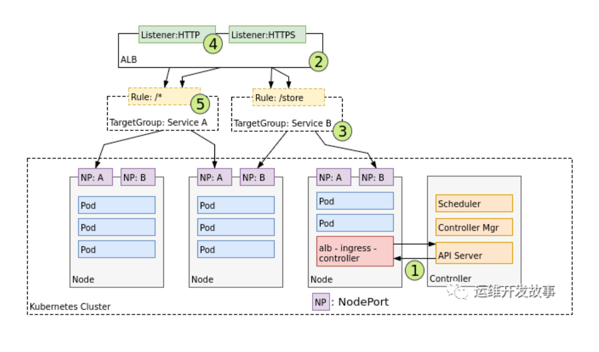

## k8s网络模型

### 基础原则

1. 每个Pod都拥有一个独立的IP地址，而且假定所有Pod都在一个可以直接连通的、扁平的网络空间中，不管是否运行在同一Node上都可以通过Pod的IP来访问。
2. k8s中Pod的IP是最小粒度IP。同一个Pod内所有的容器共享一个网络堆栈，该模型称为IP-per-Pod模型。从该模型的网络端口分配、域名解析、服务发现、负载均衡、应用配置和迁移等角度来看，Pod都能够可以被看做一台独立的虚拟机或物理机。按照这个网络抽象原则，所有Pod都可以在不用NAT的方式下同。

###  k8s集群IP概念
+ **Proxy-IP**:代理层公网地址IP，外部访问应用的网关服务器。
+ **Service-IP**:Service的固定虚拟IP，Service-IP是内部，外部无法寻址到。
+ **Node-IP**:容器宿主机的主机IP。
+ **Container-Bridge-IP**:容器网桥（docker0）IP，容器的网络都需要通过容器网桥转发。
+ **Pod-IP**:Pod的IP，等效于Pod中网络容器的Container-IP。
+ **Container-IP**:容器的IP，容器的网络是个隔离的网络空间。

### 网络模型相关的核心资源
与网络模型相关的核心资源主要有两个：Service与Ingress

### 实现

#### linux网络模型
通常，我们将虚拟机中的网络通信视为直接与以太网设备交互。

在 Linux 中，每个正在运行的进程都在一个网络命名空间内进行通信，该命名空间为逻辑网络堆栈提供了自己的路由、防火墙规则和网络设备。本质上，网络命名空间为命名空间内的所有进程提供了一个全新的网络堆栈。作为 Linux 用户，可以使用 ip 命令创建网络命名空间。

默认情况下，Linux 将每个进程分配给根网络命名空间以提供对外部世界的访问。

##### eth:
th0 是在类 Unix 操作系统（如 Linux 和 BSD）中常见的网络接口名称，表示第一个以太网网络接口。网络接口是连接计算机与网络的设备或端口，负责处理计算机与外部网络的通信。eth0 通常用于有线以太网连接，而在同一系统上，第二个以太网接口通常被命名为 eth1。

##### veth:
veth（Virtual Ethernet）是虚拟网络接口的一种，用于在网络命名空间之间创建虚拟网络连接。veth 设备成对出现，类似于一个虚拟网线的两端，一个接口的数据包会出现在另一个接口上。

#### 同一pod内不同容器通信：
k8s创建Pod时永远都是首先创建**Infra 容器**，也可以被称为**pause容器**。这个容器为其他容器提供了一个共享的基础设施，包括网络和存储功能，其他业务容器共享pause容器的网络栈和Volume挂载卷。

pause 容器被创建后会初始化Network Namespace网络栈，之后其他容器就可以加入到pause 容器中共享Infra容器的网络了。而对于同一个 Pod 里面的所有用户容器来说，它们的进出流量，认为都是通过 pause 容器完成的。

pause 容器会创建并管理虚拟以太网（veth）接口。在容器启动之前，pause 容器会为每个容器创建一个虚拟以太网接口，一个保留在宿主机上（称为 vethxxx），另一个保留在容器网络命名空间内并重命名为 eth0，如下图所示。这两个虚拟接口的两端是连接在一起的，从一端进入的数据会从另一端出来。

所以，在Kubernetes中，同一个Pod内的容器间通信就如同在同一台机器上，甚至可以用localhost地址访问彼此的端口。

#### 同一节点，不同Pod之间的通信：
Kubernetes为每个Pod都分配了唯一的IP地址，称之为Pod IP，这个IP也是Pause容器的IP。

同一节点，不同Pod之间的通信是通过根命名空间上的网桥实现的。

Linux 以太网网桥是一个虚拟的第 2 层网络设备，用于联合两个或多个网段，透明地工作以将两个网络连接在一起。网桥通过检查通过它的数据包的目的地并决定是否将数据包传递到连接到网桥的其他网段来维护源和目标之间的转发表来运行。桥接代码通过查看网络中每个以太网设备的唯一 MAC 地址来决定是桥接数据还是丢弃数据。

#### 不同节点，不同pod之间的通信：
Kubernetes 网络模型要求 Pod IP 可以通过网络访问，但它没有指定必须如何完成。所以，**不同网络插件的处理方式不同**。

通常，集群中的每个节点都分配有一个 CIDR 块，指定该节点上运行的 Pod 可用的 IP 地址。一旦流向 CIDR 块的流量到达节点，节点就有责任将流量转发到正确的 Pod。下图说明了两个节点之间的流量流，假设网络可以将 CIDR 块中的流量路由到正确的节点。

前半部分的流程与同节点 pod 间通信类似，当请求到达网桥，网桥询问哪个 pod 拥有该 IP 但是没有得到回应。流程进入主机的路由寻址过程，到更高的集群层面。

在集群层面有一张路由表，里面存储着每个节点的 Pod IP 网段（节点加入到集群时会分配一个 Pod 网段（Pod CIDR），比如在 k3s 中默认的 Pod CIDR 是 10.42.0.0/16，节点获取到的网段是 10.42.0.0/24、10.42.1.0/24、10.42.2.0/24，依次类推）。通过节点的 Pod IP 网段可以判断出请求 IP 的节点，然后请求被发送到该节点。

目标 Pod（以绿色突出显示）与源 Pod（以蓝色突出显示）位于不同的节点上。数据包首先通过 Pod 1 的以太网设备发送，该设备与根命名空间 (1) 中的虚拟以太网设备配对。最终，数据包最终到达根命名空间的网桥 (2)。ARP 将在网桥上失败，因为没有设备连接到网桥并具有正确的数据包 MAC 地址。失败时，网桥将数据包发送到默认路由——根命名空间的 eth0 设备。此时路由离开节点并进入网络 (3)。我们现在假设网络可以根据分配给节点的 CIDR 块将数据包路由到正确的节点 (4)。数据包进入目标节点的根命名空间（VM 2 上的 eth0），在那里它通过网桥路由到正确的虚拟以太网设备 (5)。最后，路由通过位于 Pod 4 的命名空间 (6) 中的虚拟以太网设备对来完成。一般来说，每个节点都知道如何将数据包传递给在其中运行的 Pod。一旦数据包到达目标节点，数据包的流动方式与在同一节点上的 Pod 之间路由流量的方式相同。

可以简单总结为：
1. 发送到根命名空间，在根命名空间里找
2. 没找到，进入网络
3. 根据网络转发的实现找到目标pod
4. 转换为同一节点之间的情况

#### pod与service之间的网络通信：
Pod IP 地址不是持久的，并且会随着扩展或缩减、应用程序崩溃或节点重启而出现和消失。这些事件中的每一个都可以使 Pod IP 地址在没有警告的情况下更改。Service被内置到 Kubernetes 中来解决这个问题。

Service充当对 Pod 的抽象，并将单个虚拟 IP 地址分配给一组 Pod IP 地址。任何发往 Service 虚拟 IP 的流量都将被转发到与虚拟 IP 关联的 Pod 集。这允许与 Service 关联的 Pod 集随时更改——客户端只需要知道 Service 的虚拟 IP即可，它不会更改。

创建新的 Kubernetes Service时，会为您创建一个新的虚拟 IP（也称为集群 IP）。在集群中的任何地方，发往虚拟 IP 的流量都将负载均衡到与服务关联的一组支持 Pod。实际上，Kubernetes 会自动创建并维护一个分布式集群内负载均衡器，将流量分配到服务相关联的健康 Pod。

##### netfilter：
为了在集群中执行负载平衡，Kubernetes 依赖于 Linux 内置的网络框架——netfilter。Netfilter 是 Linux 提供的一个框架，它允许以自定义处理程序的形式实现各种与网络相关的操作。

##### iptables：
iptables 是一个用户空间程序，它提供了一个基于表的系统，用于定义使用 netfilter 框架操作和转换数据包的规则。

在 Kubernetes 中，iptables 规则由 kube-proxy 控制器配置，该控制器监视 Kubernetes API 服务器的更改。

当对 Service 或 Pod 的更改更新 Service 的虚拟 IP 地址或 Pod 的 IP 地址时，iptables 规则会更新以正确地将指向 Service 的流量转发到正确的Pod。

iptables 规则监视发往 Service 的虚拟 IP 的流量，并且在匹配时，从可用 Pod 集中选择一个随机 Pod IP 地址，并且 iptables 规则将数据包的目标 IP 地址从 Service 的虚拟 IP 更改为选定的 Pod。

##### 通信过程：
数据包首先通过连接到 Pod 的网络命名空间 (1) 的 eth0 接口离开 Pod。然后它通过虚拟以太网设备到达网桥 (2)。网桥上运行的 ARP 协议不知道 Service，因此它通过默认路由 eth0 (3) 将数据包传输出去。在这里，发生了一些不同的事情。在 eth0 接受之前，数据包会通过 iptables 过滤。iptables 收到数据包后，使用 kube-proxy 安装在 Node 上的规则响应 Service 或 Pod 事件，将数据包的目的地从 Service IP 重写为特定的 Pod IP（4）。数据包现在注定要到达 Pod 4，而不是服务的虚拟 IP。iptables 利用 Linux 内核的 conntrack 实用程序来记住所做的 Pod 选择，以便将来的流量路由到同一个 Pod（除非发生任何扩展事件）。本质上，iptables 直接在 Node 上做了集群内负载均衡。然后流量使用我们已经检查过的 Pod 到 Pod 路由流向 Pod (5)。

Kubernetes 可以选择使用 DNS 来避免将服务的集群 IP 地址硬编码到您的应用程序中。

kubernetes DNS 作为在集群上调度的常规 Kubernetes 服务运行。它配置在每个节点上运行的 kubelet，以便容器使用 DNS 服务的 IP 来解析 DNS 名称。集群中定义的每个服务（包括 DNS 服务器本身）都被分配了一个 DNS 名称。

#### 与外部网络通信：Ingress:
第 7 层网络 Ingress 在网络堆栈的 HTTP/HTTPS 协议范围内运行，并构建在 Services 之上。

Ingress 方法将根据 Kubernetes 云提供商控制器的实现方式而有所不同。

在 AWS 环境中，ALB 入口控制器使用 Amazon 的第 7 层应用程序负载均衡器提供 Kubernetes 入口。下图详细介绍了此控制器创建的 AWS 组件。它还演示了 Ingress 流量从 ALB 到 Kubernetes 集群的路由。

创建后，(1) Ingress Controller 监视来自 Kubernetes API 服务器的 Ingress 事件。当它找到满足其要求的 Ingress 资源时，它会开始创建 AWS 资源。AWS 将 Application Load Balancer (ALB) (2) 用于Ingress 资源。

