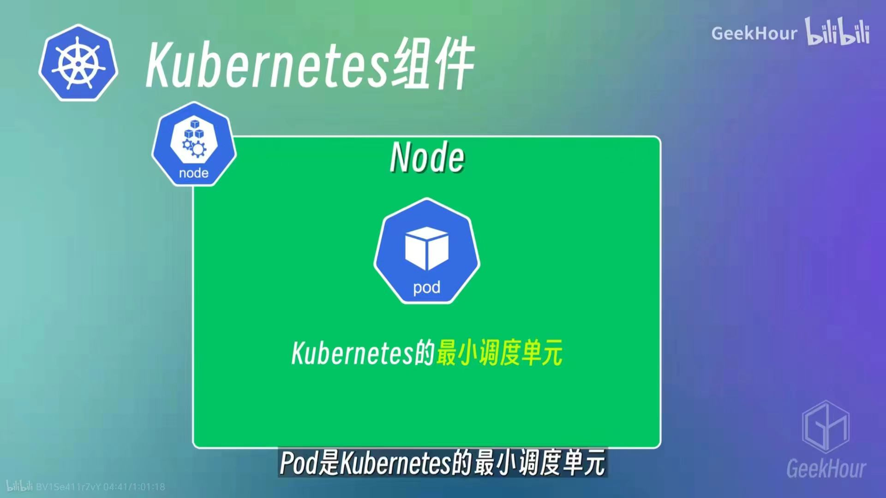
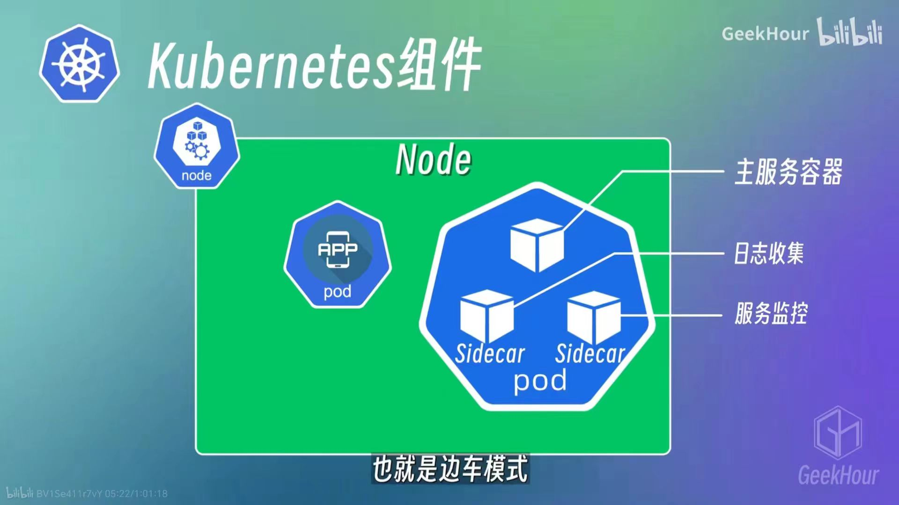
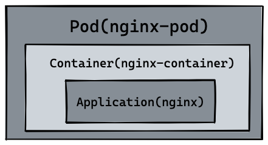
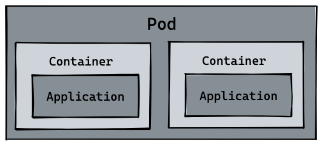
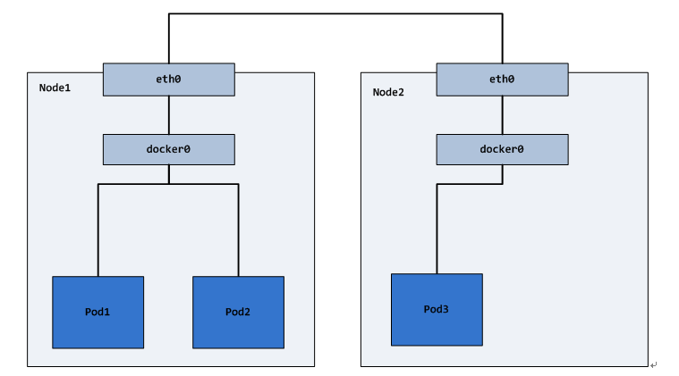

## Pod 

### Pod简介
Pod是Kubernetes中最⼩的可部署单元，中⽂可以翻译为"容器组"。它是⽤于承载和管理容器的抽象层，⼀个 Pod 可以包含⼀个或多个紧密关联的容器，它们共享相同的⽹络命名空间、IP地址和存储卷，并在同⼀个宿主机上运⾏。Pod的共享上下文包括一组Linux命名空间、cgroups和其他资源在容器中运行时的配置。Pod是Kubernetes中最⼩的调度单元，Kubernetes中的调度器会将Pod调度到集群中的节点上运⾏。

一个Pod运行多个容器，仅限于这些容器是高度耦合的情况，它们之间为了实现某种功能或共享某些资源而不得不放到同一个Pod中，例如Sidecar。也就是边车模式，将一个应用容器和一个辅助容器放到同一个Pod中，这个辅助容器就是Sidecar,通常用来实现一些辅助的功能，比如日志收集监控或者配置管理等等。



### Pod的生命周期
Pod的生命周期包括以下几个阶段：
- Pending：Pod已经被创建，但是Pod中的容器还没有被创建。
- Running：Pod中的容器已经被创建，并且至少有一个容器处于运行状态。
- Succeeded：Pod中的所有容器都已经正常退出，并且退出状态为0。
- Failed：Pod中的所有容器都已经正常退出，但是至少有一个容器的退出状态不为0。
- Unknown：Pod的状态未知，通常是由于Kubernetes控制平面与Pod通信失败导致的。
- CrashLoopBackOff：Pod中的容器已经正常退出，但是容器的重启次数超过了限制。
- Terminating：Pod正在被删除，但是Pod中的容器还没有被删除。

### Pod 与 Container 的不同

自然 pod 可以管理多个 container，在某些场景例如服务之间需要文件交换(日志收集)，本地网络通信需求(使用 localhost 或者 Socket 文件进行本地通信)，在这些场景中使用 pod 管理多个 container 就非常的推荐。而这，也是 k8s 如何处理服务之间复杂关系的第一个例子，如下图所示：



### Pod命令
```shell
# 创建Pod
kubectl create -f Pod.yaml
# 查看Pod
kubectl get Pod
# 查看Pod详细信息
kubectl describe Pod <Pod-name>
# 删除Pod
kubectl delete Pod <Pod-name>
# 查看Pod日志
kubectl logs <Pod-name>
# 进入Pod
kubectl exec -it <Pod-name> -- /bin/bash
# 将本地主机的一个端口转发到 Kubernetes 集群中的 Pod 的一个端口
kubectl port-forward <Pod-name> 8080:80
# 将本地主机的一个目录挂载到 Kubernetes 集群中的 Pod 中
kubectl cp /path/to/local/file <Pod-name>:/path/to/Pod/file
```

### Pod基本概念

#### Pod的重要字段
+ Version: String,必选，表示Pod的API版本，例如v1。
+ kind: String,必选，表示Pod的类型，例如Pod。
+ metadata: Object,必选，表示Pod的元数据，例如名称、命名空间、标签等。
+ metadata.name: String,必选，表示Pod的名称。
+ metadata.namespace: String,必选，表示Pod所在的命名空间,默认为default。
+ Spec: Object,必选，表示Pod的规格，例如容器、存储、重启策略等。
+ NodeSelector：NodeSelector是一个用来筛选Node的标签，Pod只会被调度到具有匹配标签的Node上。
+ hostNetwork: Boolean,可选，表示Pod是否使用宿主机的网络命名空间，默认为false。
```yaml    
apiVersion: v1
kind: Pod
metadata:
  name: my-pod
  namespace: default
spec:
  nodeSelector:
    disktype: ssd
    containers:
    - name: my-frontend
      image: nginx
```
这样的一个配置，意味着这个 Pod 永远只能运行在携带了"disktype": ssd”标签（Label）的节点上；否则，它将调度失败。

+ NodeName: NodeName是Pod被调度到的Node的名称，如果Pod已经被调度到Node上，NodeName字段会被自动设置。
+ HostAliases(alias:别名，化名): HostAliases是Pod的Hosts文件的配置，可以通过它来配置Pod的Hosts文件。
+ ImagePullPolicy：定义了镜像拉取的策略，它有三个值：
    - Always：总是拉取镜像；(默认)
    - IfNotPresent：如果本地没有镜像，才会拉取；
    - Never：仅当本地没有镜像时，才会拉取。
+ Lifecycle: 它定义的是 Container Lifecycle Hooks，即容器的生命周期钩子，它有两个字段，PostStart和PreStop，分别表示容器启动后和停止前的钩子。

```yaml
apiVersion: v1
kind: Pod
metadata:
  name: lifecycle-demo
spec:
  containers:
  - name: lifecycle-demo-container
    image: nginx
    lifecycle:
      postStart:
        exec:
          command: ["/bin/sh", "-c", "echo Hello from the postStart handler > /usr/share/message"]
      preStop:
        exec:
          command: ["/usr/sbin/nginx","-s","quit"]
```
这是一个来自 Kubernetes 官方文档的 Pod 的 YAML 文件。

### 存储
一个 Pod 可以设置一组共享的存储卷。 Pod 中的所有容器都可以访问该共享卷，从而允许这些容器共享数据。卷还允许 Pod 中的持久数据保留下来，即使其中的容器需要重新启动。

### 网络：
每个Pod都在每个地址族中获得一个唯一的IP地址。 Pod中的每个容器共享网络名字空间，包括IP地址和网络端口。
Pod内的容器可以使用localhost互相通信。不同Pod中的容器的IP地址互不相同，如果没有特殊配置，就无法通过OS级IPC进行通信。
当Pod中的容器与Pod之外的实体通信时，它们必须协调如何使用共享的网络资源（例如端口）。具体细节如下：

#### 同Node的Pod之间的通信
同一个Node内，不同的Pod都有一个全局IP，可以直接通过Pod的IP进行通信。Pod地址和docker0在同一个网段。

在pause容器启动之前，会创建一个虚拟以太网接口对（veth pair），该接口对一端连着容器内部的eth0 ，一端连着容器外部的vethxxx，vethxxx会绑定到容器运行时配置使用的网桥bridge0上，从该网络的IP段中分配IP给容器的eth0。

当同节点上的Pod-A发包给Pod-B时，包传送路线如下：
> pod-a的eth0—>pod-a的vethxxx—>bridge0—>pod-b的vethxxx—>pod-b的eth0

因为相同节点的bridge0是相通的，因此可以通过bridge0来完成不同pod直接的通信，但是不同节点的bridge0是不通的，因此不同节点的pod之间的通信需要将不同节点的bridge0给连接起来。

#### 不同Node的Pod之间的通信
不同的Node之间，Node的IP相当于外网IP，可以直接访问，而Node内的docker0和Pod的IP则是内网IP，无法直接跨Node访问。需要通过Node的网卡进行转发。

所以不同Node之间的通信需要达到两个条件：

1. 对整个集群中的Pod-IP分配进行规划，不能有冲突（可以通过第三方开源工具来管理，例如flannel）。
2. 将Node-IP与该Node上的Pod-IP关联起来，通过Node-IP再转发到Pod-IP。

不同节点的Pod之间的通信需要将不同节点的bridge0给连接起来。连接不同节点的bridge0的方式有好几种，主要有overlay和underlay，或常规的三层路由。

不同节点的bridge0需要不同的IP段，保证Pod IP分配不会冲突，节点的物理网卡eth0也要和该节点的网桥bridge0连接。因此，节点a上的pod-a发包给节点b上的pod-b，路线如下：
> 节点a上的pod-a的eth0—>pod-a的vethxxx—>节点a的bridge0—>节点a的eth0—>
> 节点b的eth0—>节点b的bridge0—>pod-b的vethxxx—>pod-b的eth0


### 使用进阶
通常你不需要直接创建 Pod，甚至单实例 Pod。相反，你会使用诸如Deployment 或 Job这类工作负载资源来创建 Pod。 如果 Pod 需要跟踪状态，可以考虑StatefulSet资源。

你很少在 Kubernetes 中直接创建一个个的 Pod，甚至是单实例（Singleton）的 Pod。 这是因为 Pod 被设计成了相对临时性的、用后即抛的一次性实体。 当 Pod 由你或者间接地由控制器创建时，它被调度在集群中的节点上运行。 Pod 会保持在该节点上运行，直到 Pod 结束执行、Pod 对象被删除、Pod 因资源不足而被驱逐或者节点失效为止。

在 Kubernetes 中，有几种特殊的 Volume，它们存在的意义不是为了存放容器里的数据，也不是用来进行容器和宿主机之间的数据交换。这些特殊 Volume 的作用，是为容器提供预先定义好的数据。
+ Secret：用来存放敏感数据，例如密码、OAuth 令牌到等。
  Secret 最典型的使用场景，莫过于存放数据库的 Credential 信息，比如下面这个例子：
```yaml
apiVersion: v1
kind: Pod
metadata:
  name: test-projected-volume 
spec:
  containers:
  - name: test-secret-volume
    image: busybox
    args:
    - sleep
    - "86400"
    volumeMounts:
    - name: mysql-cred
      mountPath: "/projected-volume"
      readOnly: true
  volumes:
  - name: mysql-cred
    projected:
      sources:
      - secret:
          name: user
      - secret:
          name: pass
```
这个 Pod 里，有两个 Secret，分别是 user 和 pass。这两个 Secret 会被挂载到 /projected-volume 目录下，而且是只读的。这里用到的数据库的用户名、密码，正是以 Secret 对象的方式交给 Kubernetes 保存的。完成这个操作的指令，如下所示：
```
$ cat ./username.txt
admin
$ cat ./password.txt
c1oudc0w!
 
$ kubectl create secret generic user --from-file=./username.txt
$ kubectl create secret generic pass --from-file=./password.txt
```
其中，username.txt 和 password.txt 文件里，存放的就是用户名和密码；
查看这些 Secret 对象。
```
$ kubectl get secrets
NAME           TYPE                                DATA      AGE
user          Opaque                                1         51s
pass          Opaque                                1         51s
```
除了使用 kubectl create secret 指令外，也可以直接通过编写 YAML 文件的方式来创建这个 Secret 对象
```yaml
apiVersion: v1
kind: Secret
metadata:
  name: mysecret
type: Opaque
data:
  user: YWRtaW4=
  pass: MWYyZDFlMmU2N2Rm
```
+ ConfigMap：用来存放配置文件，例如环境变量、配置文件等。
  ConfigMap 也是 Kubernetes 中的一种资源对象，它的作用是存放配置文件。比如，我们有一个应用程序，需要读取一个配置文件，这个配置文件里存放了一些环墮变量，比如数据库的地址、端口号等等。这时，我们就可以使用 ConfigMap 来存放这些配置文件。
```
# .properties 文件的内容
$ cat example/ui.properties
color.good=purple
color.bad=yellow
allow.textmode=true
how.nice.to.look=fairlyNice
 
# 从.properties 文件创建 ConfigMap
$ kubectl create configmap ui-config --from-file=example/ui.properties
 
# 查看这个 ConfigMap 里保存的信息 (data)
$ kubectl get configmaps ui-config -o yaml
apiVersion: v1
data:
  ui.properties: |
    color.good=purple
    color.bad=yellow
    allow.textmode=true
    how.nice.to.look=fairlyNice
kind: ConfigMap
metadata:
  name: ui-config
  ...
```
+ DownwardAPI：用来将 Pod 的信息注入到容器中，例如 Pod 的名称、IP地址等。
  DownwardAPI 是 Kubernetes 中的一种 Volume，它的作用是将 Pod 的信息注入到容器中。这些信息包括 Pod 的名称、IP 地址、Namespace 等等。这些信息，可以通过环境变量的方式，注入到容器中。
```yaml
apiVersion: v1
kind: Pod
metadata:
  name: test-downwardapi-volume
  labels:
    zone: us-est-coast
    cluster: test-cluster1
    rack: rack-22
spec:
  containers:
    - name: client-container
      image: k8s.gcr.io/busybox
      command: ["sh", "-c"]
      args:
      - while true; do
          if [[ -e /etc/podinfo/labels ]]; then
            echo -en '\n\n'; cat /etc/podinfo/labels; fi;
          sleep 5;
        done;
      volumeMounts:
        - name: podinfo
          mountPath: /etc/podinfo
          readOnly: false
  volumes:
    - name: podinfo
      projected:
        sources:
        - downwardAPI:
            items:
              - path: "labels"
                fieldRef:
                  fieldPath: metadata.labels
```