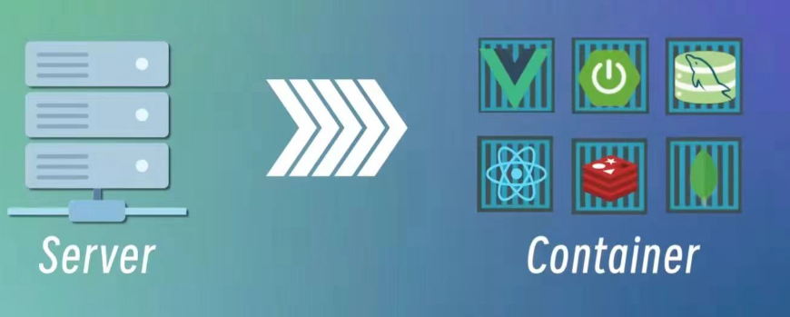
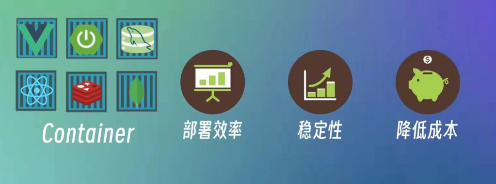
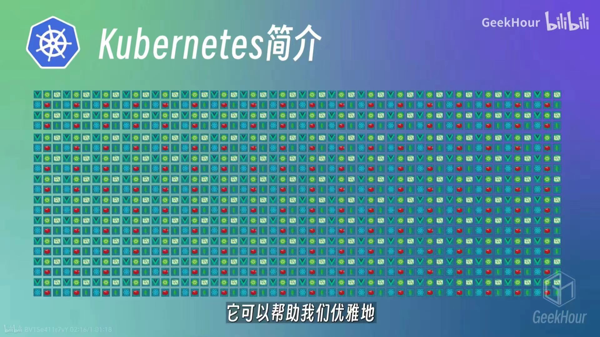
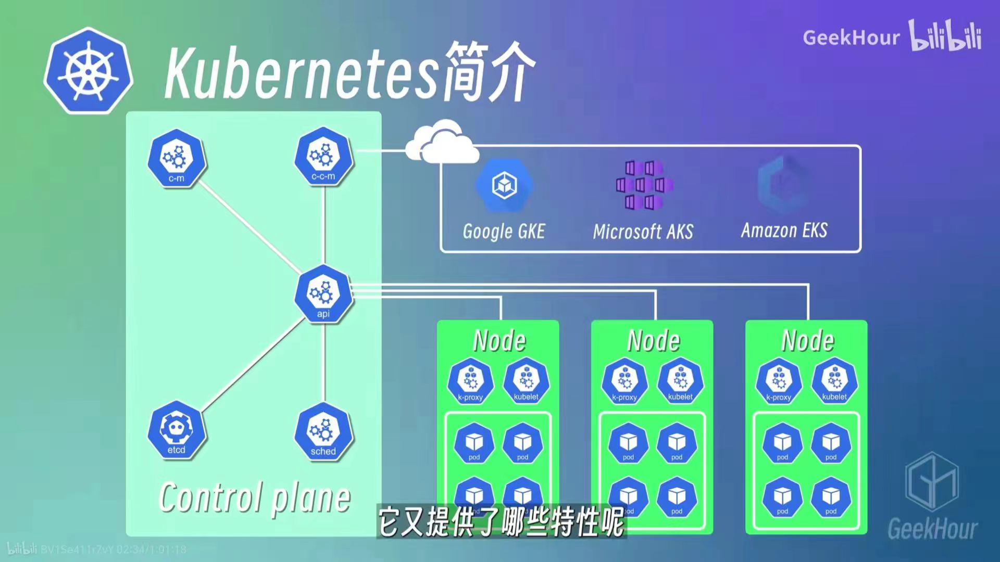
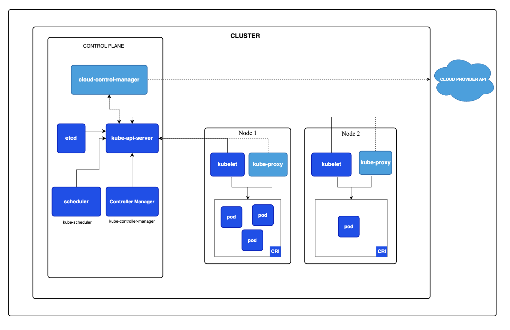
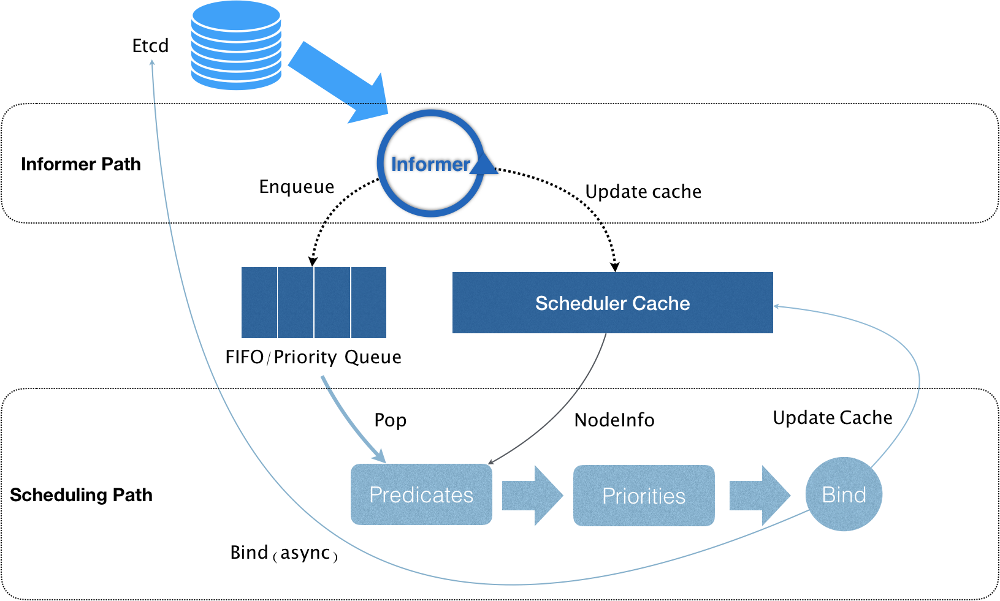

## Kubernetes

### [Kubernetes](https://kubernetes.io/)简介
随着容器化技术的快速发展，越来越多的企业与开发者都开始微服务与容器化技术来构建自己的服务和应用程序，


容器化优点很多


其带来了一些新的问题，这其中最突出的是容器的数量会变得非常多，架构也越来越复杂，那么如何管理和维护这些容器就成了一个非常大的挑战与难题。


[Kubernetes](https://kubernetes.io/)是一个开源的容器编排引擎，可以用来管理容器化的应用，
包括容器的自动化的部署、扩容、缩容、升级、回滚等等，它是Google在2014年开源的一个项目，它的前身是Google内部的Borg系统。



### 2. 为什么要使用[Kubernetes](https://kubernetes.io/)
在[Kubernetes](https://kubernetes.io/)出现之前，
我们一般都是使用Docker来管理容器化的应用，
但是Docker只是一个单机的容器管理工具，
它只能管理单个节点上的容器，
当我们的应用程序需要运行在多个节点上的时候，
就需要使用一些其他的工具来管理这些节点，
比如Docker Swarm、Mesos、[Kubernetes](https://kubernetes.io/)等等，
这些工具都是容器编排引擎，
它们可以用来管理多个节点上的容器，
但是它们之间也有一些区别，
比如Docker Swarm是Docker官方提供的一个容器编排引擎，
它的功能比较简单，
适合于一些小型的、简单的场景，
而Mesos和[Kubernetes](https://kubernetes.io/)则是比较复杂的容器编排引擎，Mesos是Apache基金会的一个开源项目，
而[Kubernetes](https://kubernetes.io/)是Google在2014年开源的，
目前已经成为了CNCF（Cloud Native Computing Foundation）的一个顶级项目，
基本上已经成为了容器编排引擎的事实标准了。

### 3. Kubernetes工作流程


Kubernetes的工作流程通常如下：
+ 用户通过Kubernetes API与集群交互，创建或更新资源对象，如Pods、Services等。
+ API Server接收请求，并与etcd通信，更新集群状态。
+ Scheduler根据资源需求和集群的当前状态，决定将Pods调度到哪个节点。
+ Controller Manager监控集群状态，确保实际状态与期望状态一致。
+ Kubelet在各个节点上根据调度结果创建或删除Pods，并通过CRI与容器运行时进行交互。
+ Kube-proxy在每个节点上配置网络规则，确保Pods可以被访问。
整个流程是自动化的，Kubernetes会持续监控集群状态，并自动进行必要的调整以维持系统的稳定性和可用性。

### 4. 对象模型
在 Kubernetes 系统中，Kubernetes对象是持久化的实体。 Kubernetes使用这些实体去表示整个集群的状态。
Kubernetes 对象是一种“意向表达(Record of Intent)”。一旦创建该对象， Kubernetes 系统将不断工作以确保该对象存在。通过创建对象，你本质上是在告知 Kubernetes 系统，你想要的集群工作负载状态看起来应是什么样子的， 这就是 Kubernetes 集群所谓的期望状态(Desired State)。

**对象的描述：清单**

在Kubernetes中，描述一个对象通常使用YAML或JSON格式的清单文件（manifest file）。这些清单文件定义了Kubernetes资源对象的期望状态，包括它们的配置、行为和依赖关系。以下是描述Kubernetes对象的基本步骤和组成部分：
1. API版本（apiVersion）：
   指定Kubernetes API的版本，这决定了清单文件的结构和可用的字段。
2. 类型（Kind）：
   指定要创建的Kubernetes对象的类型，例如Pod、Service、Deployment等。
3. 元数据（metadata）：
   包含对象的识别信息，如名称（name）、命名空间（namespace）、标签（labels）和注解（annotations）。
4. 规约（spec）：
   描述了对象的期望状态和行为。这是用户定义的部分，Kubernetes将根据这些规约来创建和维护对象。对每个 Kubernetes 对象而言，其spec之精确格式都是不同的，包含了特定于该对象的嵌套字段。

操作 Kubernetes 对象 —— 无论是创建、修改或者删除 —— 需要使用 Kubernetes API。 比如，当使用 kubectl 命令行接口（CLI）时，CLI 会调用必要的 Kubernetes API； 也可以在程序中使用客户端库， 来直接调用 Kubernetes API。

每个 Kubernetes 对象包含两个嵌套的对象字段，它们负责管理对象的配置： spec（规约）和对象 status（状态）。

+ **spec** 从面向对象程序设计的角度，spec可以理解为对象的属性。
spec是Kubernetes对象的规范或声明性配置，它描述了用户希望集群如何运行和管理该对象。spec是不可变的，意味着一旦创建，用户不能直接修改它。但是，可以通过更新对象来更改其spec，这会导致Kubernetes创建一个新版本的资源对象。以下是spec的一些关键特性：
    + 声明性：用户只需声明期望的状态，Kubernetes负责实现这一状态。
    + 不可变性：直接修改spec是不可能的，需要通过更新操作来实现。
    + 每次更新spec，Kubernetes都会创建一个新的对象版本，这有助于追踪变更历史。
例如，一个Pod的spec可能包括以下信息：
      + 容器的镜像名称和版本。
      + 容器所需的CPU和内存资源限制。 
      + 环境变量。
      + 容器的端口映射。

  + **status** status是Kubernetes对象的当前运行状态，由Kubernetes系统根据对象的实际运行情况自动更新。status提供了对象的实时信息，如是否正在运行、是否就绪、以及任何错误或警告。以下是status的一些关键特性：
    + 实时性：status字段由Kubernetes系统根据对象的实际运行状态实时更新。
    + 只读：用户不能直接修改status，它由系统自动维护。
    + 详细性：status可能包含多种信息，如对象的健康状态、条件、资源使用情况等。
    
  例如，一个Pod的status可能包括： 
  + Pod的当前阶段（如Pending、Running、Succeeded、Failed、Unknown）。
  + 容器的重启次数。 
  + Pod的IP地址。
  + 条件（如Ready、Initialized）。
  
通过分离spec和status，Kubernetes提供了一种强大的方式来管理集群资源，允许用户专注于定义期望状态，而由系统负责实现和管理这些状态。这种模式简化了集群管理，并提高了自动化和可扩展性。

### Kubernetes 的资源模型与资源管理
在 Kubernetes 中，像 CPU 这样的资源被称作“可压缩资源”（compressible resources）,它的典型特点是:当可压缩资源不足时,Pod 只会“饥饿”（starve）,而不会被驱逐（evict）。
而像内存这样的资源，则被称作“不可压缩资源（incompressible resources）。当不可压缩资源不足时，Pod 就会因为 OOM（Out-Of-Memory）被内核杀掉。
而由于 Pod 可以由多个 Container 组成，所以 CPU 和内存资源的限额，是要配置在每个 Container 的定义上的。这样，Pod 整体的资源配置，就由这些 Container 的配置值累加得到。
其中，Kubernetes 里为 CPU 设置的单位是“CPU 的个数”。比如，cpu=1 指的就是，这个 Pod 的 CPU 限额是 1 个 CPU。当然，具体“1 个 CPU”在宿主机上如何解释，是 1 个 CPU 核心，还是 1 个 vCPU，还是 1 个 CPU 的超线程（Hyperthread），完全取决于宿主机的 CPU 实现方式。Kubernetes 只负责保证 Pod 能够使用到“1 个 CPU”的计算能力。

此外，Kubernetes 允许你将 CPU 限额设置为分数，比如在我们的例子里，CPU limits 的值就是 500m。所谓 500m，指的就是 500 millicpu，也就是 0.5 个 CPU 的意思。这样，这个 Pod 就会被分配到 1 个 CPU 一半的计算能力。
在实际使用时，还是推荐你使用 500m 的写法，毕竟这才是 Kubernetes 内部通用的 CPU 表示方式。
而对于内存资源来说，它的单位自然就是 bytes。Kubernetes 支持你使用 Ei、Pi、Ti、Gi、Mi、Ki（或者 E、P、T、G、M、K）的方式来作为 bytes 的值。

> 备注：1Mi=1024*1024；1M=1000*1000

**Kubernetes 里 Pod 的 CPU 和内存资源，实际上还要分为 limits 和 requests 两种情况**
- limits：指的是 Pod 的资源限额。当 Pod 的资源使用超过了 limits 的值时，Pod 就会被驱逐（evict）。
- requests：指的是 Pod 的资源请求。当 Pod 的资源使用超过了 requests 的值时，Pod 就会被“饥饿”（starve）。

更确切地说，当你指定了 requests.cpu=250m 之后，相当于将 Cgroups 的 cpu.shares 的值设置为 (250/1000)*1024。而当你没有设置 requests.cpu 的时候，cpu.shares 默认则是 1024。这样，Kubernetes 就通过 cpu.shares 完成了对 CPU 时间的按比例分配。

而如果你指定了 limits.cpu=500m 之后，则相当于将 Cgroups 的 cpu.cfs_quota_us 的值设置为 (500/1000)*100ms，而 cpu.cfs_period_us 的值始终是 100ms。这样，Kubernetes 就为你设置了这个容器只能用到 CPU 的 50%。

而对于内存来说，当你指定了 limits.memory=128Mi 之后，相当于将 Cgroups 的 memory.limit_in_bytes 设置为 128 * 1024 * 1024。而需要注意的是，在调度的时候，调度器只会使用 requests.memory=64Mi 来进行判断。

**Kubernetes 这种对 CPU 和内存资源限额的设计，实际上参考了 Borg 论文中对“动态资源边界”的定义，既：容器化作业在提交时所设置的资源边界，并不一定是调度系统所必须严格遵守的，这是因为在实际场景中，大多数作业使用到的资源其实远小于它所请求的资源限额。**

### Kubernetes的QoS模型
QoS（Quality of Service）是 Kubernetes 里的一个重要概念，它用来描述 Pod 的质量服务。Kubernetes 里的 QoS 模型，实际上是根据 Pod 的 requests 和 limits 的设置，来判断 Pod 的质量服务等级的。
**当 Pod 里的每一个 Container 都同时设置了 requests 和 limits，并且 requests 和 limits 值相等的时候，这个 Pod 就属于 Guaranteed 类别，如下所示：**
```
apiVersion: v1
kind: Pod
metadata:
  name: qos-guaranteed
  namspace: qos-example
spec:
    containers:
    - name: qos-guaranteed
        image: nginx
        resources:
        requests:
            memory: "64Mi"
            cpu: "250m"
        limits:
            memory: "64Mi"
            cpu: "250m"

```
**而当 Pod 里的每一个 Container 都设置了 requests 和 limits，但是 requests 和 limits 值不相等的时候，这个 Pod 就属于 Burstable 类别，如下所示：**
```
apiVersion: v1
kind: Pod
metadata:
  name: qos-burstable
  namspace: qos-example
spec:
    containers:
    - name: qos-burstable
        image: nginx
        resources:
        requests:
            memory: "64Mi"
            cpu: "250m"
        limits:
            memory: "128Mi"
            cpu: "500m"
```
**而当 Pod 里的每一个 Container 都没有设置 requests 和 limits 的时候，这个 Pod 就属于 BestEffort 类别，如下所示：**
```
apiVersion: v1
kind: Pod
metadata:
  name: qos-besteffort
  namspace: qos-example
spec:
    containers:
    - name: qos-besteffort
        image: nginx
```

实际上，QoS 划分的主要应用场景，是当宿主机资源紧张的时候，kubelet 对 Pod 进行 Eviction（即资源回收）时需要用到的。
**当 kubelet 发现宿主机资源不足时，它会根据 QoS 类别，优先回收 BestEffort 类别的 Pod。而对于 Guaranteed 类别的 Pod，kubelet 会尽量保留它们的资源；而对于 Burstable 类别的 Pod，kubelet 则会根据它们的使用情况，来决定是否回收它们的资源。**
具体地说，当 Kubernetes 所管理的宿主机上不可压缩资源短缺时，就有可能触发 Eviction。比如，可用内存（memory.available）、可用的宿主机磁盘空间（nodefs.available），以及容器运行时镜像存储空间（imagefs.available）等等。


**Eviction 在 Kubernetes 里其实分为 Soft 和 Hard 两种模式。**
- Soft Eviction：当宿主机资源不足时，kubelet 会尝试通过 Soft Eviction 来释放资源。Soft Eviction 会尝试通过删除 Pod 的方式来释放资源，但是它不会删除 Guaranteed 类别的 Pod。
- Hard Eviction：当 Soft Eviction 无法释放足够的资源时，kubelet 就会尝试通过 Hard Eviction 来释放资源。Hard Eviction 会删除 Guaranteed 类别的 Pod，以及其他所有类型的 Pod。

> Kubernetes 计算 Eviction 阈值的数据来源，主要依赖于从 Cgroups 读取到的值，以及使用 cAdvisor 监控到的数据。而 kubelet 会根据这些数据，来计算出 Pod 的 QoS 类别，以及是否需要触发 Eviction。

#### Kubernetes特性：cpuset 的设置
我们知道，在使用容器的时候，你可以通过设置 cpuset 把容器绑定到某个 CPU 的核上，而不是像 cpushare 那样共享 CPU 的计算能力。

这种情况下，由于操作系统在 CPU 之间进行上下文切换的次数大大减少，容器里应用的性能会得到大幅提升。事实上，cpuset 方式，是生产环境里部署在线应用类型的 Pod 时，非常常用的一种方式。

这样的需求在 Kubernetes 里又该如何实现呢？
- 首先，你的 Pod 必须是 Guaranteed 的 QoS 类型；
- 然后，你只需要将 Pod 的 CPU 资源的 requests 和 limits 设置为同一个相等的整数值即可。

比如下面这个例子：
```
spec:
    containers:
    - name: cpuset-demo
        image: nginx
        resources:
        requests:
            memory: "200Mi"
            cpu: "2"
        limits:
            memory: "200Mi"
            cpu: "2"
```

这时候，该 Pod 就会被绑定在 2 个独占的 CPU 核上。当然，具体是哪两个 CPU 核，是由 kubelet 为你分配的。

### Kubernetes默认调度器（default scheduler）
**在 Kubernetes 项目中，默认调度器的主要职责，就是为一个新创建出来的 Pod，寻找一个最合适的节点（Node）。**
而这里“最合适”的含义，包括两层：
+ 从集群所有的节点中，根据调度算法挑选出所有可以运行该 Pod 的节点;
+ 从第一步的结果中，再根据调度算法挑选一个最符合条件的节点作为最终结果。

所以在具体的调度流程中，默认调度器会首先调用一组叫作 Predicate 的调度算法，来检查每个 Node。然后，再调用一组叫作 Priority 的调度算法，来给上一步得到的结果里的每个 Node 打分。最终的调度结果，就是得分最高的那个 Node。
调度器对一个 Pod 调度成功，实际上就是将它的 spec.nodeName 字段填上调度结果的节点名字。

可以看到，Kubernetes 的调度器的核心，实际上就是两个相互独立的控制循环。

#### 第一个控制循环
称之为 Informer Path。它的主要目的，是启动一系列 Informer，用来监听（Watch）Etcd 中 Pod、Node、Service 等与调度相关的 API 对象的变化。比如，当一个待调度 Pod（即：它的 nodeName 字段是空的）被创建出来之后，调度器就会通过 Pod Informer 的 Handler，将这个待调度 Pod 添加进调度队列。

在默认情况下，Kubernetes 的调度队列是一个 PriorityQueue（优先级队列），并且当某些集群信息发生变化的时候，调度器还会对调度队列里的内容进行一些特殊操作。这里的设计，主要是出于调度优先级和抢占的考虑，我会在后面的文章中再详细介绍这部分内容。

此外，Kubernetes 的默认调度器还要负责对调度器缓存（即：scheduler cache）进行更新。事实上，Kubernetes 调度部分进行性能优化的一个最根本原则，就是尽最大可能将集群信息 Cache 化，以便从根本上提高 Predicate 和 Priority 调度算法的执行效率。

#### 第二个控制循环
**第二个控制循环，是调度器负责 Pod 调度的主循环，我们可以称之为 Scheduling Path。**
Scheduling Path 的主要逻辑，就是不断地从调度队列里出队一个 Pod。然后，调用 Predicates 算法进行“过滤”。这一步“过滤”得到的一组 Node，就是所有可以运行这个 Pod 的宿主机列表。当然，Predicates 算法需要的 Node 信息，都是从 Scheduler Cache 里直接拿到的，这是调度器保证算法执行效率的主要手段之一。

接下来，调度器就会再调用 Priorities 算法为上述列表里的 Node 打分，分数从 0 到 10。得分最高的 Node，就会作为这次调度的结果。

调度算法执行完成后，调度器就需要将 Pod 对象的 nodeName 字段的值，修改为上述 Node 的名字。这个步骤在 Kubernetes 里面被称作 Bind。

但是，为了不在关键调度路径里远程访问 APIServer，Kubernetes 的默认调度器在 Bind 阶段，只会更新 Scheduler Cache 里的 Pod 和 Node 的信息。这种基于“乐观”假设的 API 对象更新方式，在 Kubernetes 里被称作 Assume。

Assume 之后，调度器才会创建一个 Goroutine 来异步地向 APIServer 发起更新 Pod 的请求，来真正完成 Bind 操作。如果这次异步的 Bind 过程失败了，其实也没有太大关系，等 Scheduler Cache 同步之后一切就会恢复正常。

当然，正是由于上述 Kubernetes 调度器的“乐观”绑定的设计，当一个新的 Pod 完成调度需要在某个节点上运行起来之前，该节点上的 kubelet 还会通过一个叫作 Admit 的操作来再次验证该 Pod 是否确实能够运行在该节点上。这一步 Admit 操作，实际上就是把一组叫作 GeneralPredicates 的、最基本的调度算法，比如：“资源是否可用”“端口是否冲突”等再执行一遍，作为 kubelet 端的二次确认。

#### 无锁化
在 Scheduling Path 上，调度器会启动多个 Goroutine 以节点为粒度并发执行 Predicates 算法，从而提高这一阶段的执行效率。而与之类似的，Priorities 算法也会以 MapReduce 的方式并行计算然后再进行汇总。而在这些所有需要并发的路径上，调度器会避免设置任何全局的竞争资源，从而免去了使用锁进行同步带来的巨大的性能损耗。

所以，在这种思想的指导下，如果你再去查看一下前面的调度器原理图，你就会发现，Kubernetes 调度器只有对调度队列和 Scheduler Cache 进行操作时，才需要加锁。而这两部分操作，都不在 Scheduling Path 的算法执行路径上。

当然，Kubernetes 调度器的上述设计思想，也是在集群规模不断增长的演进过程中逐步实现的。**“Cache 化”，这个变化其实是最近几年 Kubernetes 调度器性能得以提升的一个关键演化。**

